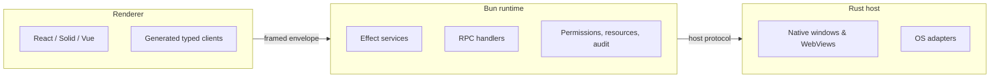

# Orika

**Type-safe, permission-aware desktop apps. Rust shell, Bun runtime, your favourite UI framework.**

Orika is a desktop application framework built on three boundaries instead of one process:

- **Rust** owns the native shell, windows, and OS adapters.
- **Bun** runs your application services, RPC handlers, jobs, and storage.
- **React / Solid / Vue / Next** owns the UI, calling typed clients generated from your contracts.

Everything privileged crosses a typed Effect service. Failures are tagged values, not exceptions. Resources are scoped. Permissions are deny-by-default. The renderer never gets raw OS authority.

```txt
Rust owns the shell.   Bun owns the runtime.   React owns the UI.   Effect owns correctness.
```

---

## Why Orika

| You want                                | Orika gives you                                                    |
| --------------------------------------- | ------------------------------------------------------------------ |
| End-to-end type safety, no codegen step | One `RpcGroup` value → handler signature + wire format + UI client |
| Renderer that cannot misuse the OS      | Deny-by-default `PermissionRegistry` at the RPC boundary           |
| Tests without an OS                     | `HeadlessRuntime` and `MockHost` ship in `@orika/test`             |
| Predictable cleanup                     | Windows, processes, watchers, PTYs all close with their scope      |
| Tauri-sized binary, TS-shaped DX        | Rust host + Bun runtime, OS WebView or bundled Chrome              |
| Failures you can `_tag`-narrow          | Tagged errors via Effect Schema, no thrown exceptions on the wire  |

If you have used Electron and wished the renderer were sandboxed, or Tauri and wished app logic stayed in TypeScript — that is the gap Orika fills.

---

## Install

Orika is pre-v1. Workspace packages are `private: true` at `0.0.0` and not yet on npm. Develop directly against this repo.

```bash
git clone https://github.com/Rika-Labs/orika.git
cd orika
bun install --frozen-lockfile
bun run desktop --help
```

Requirements: **Bun 1.3.13**, the Rust toolchain in `rust-toolchain.toml`, and your platform's native build tools (Xcode CLI on macOS, VS Build Tools on Windows, `gcc + libgtk + libwebkit2gtk` on Linux). You only need the native tools if you intend to package or run `cargo check`.

---

## Hello world

An Orika app is **two files**: a contract + runtime, and a renderer. No manifest, no scaffolder, no codegen step.

### 1. Contract and runtime

```ts
// app/App.ts
import { Effect, Schema } from "effect"
import { Rpc, RpcGroup } from "effect/unstable/rpc"
import { Desktop } from "@orika/core"

export class GreetingError extends Schema.TaggedError<GreetingError>()("GreetingError", {
  reason: Schema.String
}) {}

export const Greeting = Rpc.make("Greeting.say", {
  payload: { name: Schema.String },
  success: Schema.Struct({ message: Schema.String }),
  error: GreetingError
})

export const AppRpcs = RpcGroup.make(Greeting)

export const App = Desktop.make({
  windows: Desktop.window("main", { title: "Hello" }),
  rpcs: Desktop.rpc(
    AppRpcs,
    AppRpcs.toLayer({
      "Greeting.say": ({ name }) => Effect.succeed({ message: `Hello, ${name}!` })
    })
  )
})
```

The `RpcGroup` is the single source of truth — method names, payload schemas, result schemas, closed error set. From it Orika derives the runtime handler signature, the wire format, the renderer client, and the test client. Forget a handler and TypeScript fails the build. Change the contract and every consumer either updates or fails to compile.

### 2. Renderer — typed hooks, tagged errors

```tsx
// app/Greeter.tsx
import { Option } from "effect"
import { AsyncResult, ReactDesktop } from "@orika/react"
import { Desktop } from "@orika/core"
import { App, AppRpcs } from "./App.js"

const DesktopApp = ReactDesktop.from(Desktop.manifest(App))

export function Greeter() {
  const greeting = DesktopApp.useDesktop(AppRpcs)
  const say = greeting.say.useMutation()
  const result = AsyncResult.value(say.state)
  const error = AsyncResult.error(say.state)

  return (
    <form
      onSubmit={(event) => {
        event.preventDefault()
        const data = new FormData(event.currentTarget)
        say.run({ name: String(data.get("name") ?? "") })
      }}
    >
      <input name="name" placeholder="your name" />
      <button type="submit" disabled={say.status === "running"}>
        Greet
      </button>
      {Option.isSome(result) && <p>{result.value.message}</p>}
      {Option.isSome(error) && <p>Error: {error.value.reason}</p>}
    </form>
  )
}
```

`Desktop.manifest(App)` derives everything the renderer needs from the same `App` you already declared — no second config file, no drift. `useDesktop(AppRpcs)` returns one typed entry per RPC method, each exposing `useMutation()` or `useQuery()`. `say.state` is an `AsyncResult` — `value(...)` is fully typed, `error(...)` carries `GreetingError`. Nothing else can reach that error channel; thrown values become Effect defects.

### Run it

Drop `Greeter.tsx` into `apps/inspector/src` and import it from the inspector's root component:

```bash
cd apps/inspector && bun run dev
```

The inspector is a working renderer that already wires the provider and a dev server. For a standalone app, `ReactDesktop.from(Desktop.manifest(App)).createRoot(<Greeter />)` mounts the provider at the root.

---

## What you get out of the box

**Runtime services** (`@orika/core`) — every one is an Effect `Layer`, every effectful surface is `Effect<A, E, R>`, every disposable is `Scope`-owned:

| Service               | What it does                                          |
| --------------------- | ----------------------------------------------------- |
| `PermissionRegistry`  | Deny-by-default capability checks at the RPC boundary |
| `ApprovalBroker`      | User-prompt approvals with coalescing                 |
| `AuditEvents`         | Streamed audit log of every privileged call           |
| `ResourceRegistry`    | Scoped ownership for windows, jobs, workers, PTYs     |
| `Filesystem`          | Permission-checked read / write / watch               |
| `Process` / `Sidecar` | Supervised child processes with backpressured stdout  |
| `PTY`                 | Real PTYs via `native-pty`                            |
| `Worker` / `Job`      | Background workers and scheduled jobs                 |
| `SqlClient`           | SQLite client with migrations                         |
| `Settings`            | Schema-validated user settings                        |
| `Secrets`             | OS keychain via `SafeStorage`                         |
| `Telemetry`           | OTLP-shaped tracing and metrics                       |
| `WindowState`         | Multi-window position / size persistence              |

**Native RPC groups** (`@orika/native`) — typed surfaces for `App`, `Clipboard`, `ContextMenu`, `CrashReporter`, `Dialog`, `Dock`, `GlobalShortcut`, `Menu`, `Notification`, `Path`, `PowerMonitor`, `Protocol`, `SafeStorage`, `Screen`, `Shell`, `SystemAppearance`, `Tray`, `Updater`, `WebView`, `Window`. Every call crosses `PermissionRegistry` and emits an audit event.

**Renderer adapters** — `@orika/react`, `@orika/solid`, `@orika/vue`, `@orika/next`, `@orika/vite`. All consume the same `RpcGroup` values; the contract is portable across UI frameworks.

**A first-party CLI** — `bun run desktop`:

```
desktop check       Lint, typecheck, test the framework
desktop build       Build runtime + native artifacts
desktop package     Produce a macOS/Windows/Linux bundle
desktop sign        Codesign macOS bundles
desktop notarize    Apple notarization
desktop publish     Publish a release with reproducibility evidence
desktop doctor      Diagnose toolchain and config
```

**A headless test runtime** — `@orika/test` ships `MockHost`, `MockBridge`, and a `HeadlessRuntime` so you can exercise handlers and permission checks without a real OS or WebView.

---

## The mental model



Three roles, one envelope between each pair, total observability. The renderer never holds raw native authority — every privileged call traverses a typed RPC client → bridge envelope → runtime handler → permission check → adapter. That single boundary is where types, audit, permissions, and test doubles all attach.

---

## Status

**Pre-v1.** Public APIs are stable in shape but not in version. Everything in `docs/` is grounded in current source — if you can read it, you can grep it. Workspace packages are not yet published to npm; develop against this repository directly.

Run the framework's own checks on a clean clone:

```bash
bun run check       # Ultracite (oxlint + oxfmt)
bun run typecheck   # tsgo across all packages
bun test            # Bun test runner
cargo check --workspace
```

`bun install` runs a `postinstall` that patches `@typescript/native-preview` with `@effect/tsgo`, so the local `tsgo` command and your editor's LSP use the Effect language service automatically.

If anything fails on a clean clone, file an issue — it's not your machine.

---

## Documentation

Full docs follow [Diátaxis](https://diataxis.fr/) — four modes for four reader needs:

|                      | Practical                                                  | Theoretical                                                          |
| -------------------- | ---------------------------------------------------------- | -------------------------------------------------------------------- |
| **Learning** (study) | [Tutorials →](docs/tutorials/) guided walkthroughs         | [Explanation →](docs/explanation/) why the framework looks like this |
| **Working** (apply)  | [How-to guides →](docs/how-to/) recipes for specific tasks | [Reference →](docs/reference/) every public symbol                   |

Highest-leverage starting points:

- [Build your first app in 5 minutes](docs/start/first-app.md)
- [Architecture overview](docs/explanation/architecture.md)
- [The boundary rule](docs/explanation/boundary-rule.md)
- [Permissions model](docs/explanation/permissions-model.md)
- [`Desktop` API reference](docs/reference/desktop-api.md)

The [docs landing page](docs/README.md) is the full index. For LLM consumption, see [`llms.txt`](llms.txt).

---

## Repository map

| Path                                                                                                                                        | Purpose                                                 |
| ------------------------------------------------------------------------------------------------------------------------------------------- | ------------------------------------------------------- |
| [`crates/host/`](crates/host)                                                                                                               | Rust native host and WebView shell                      |
| [`crates/host-protocol/`](crates/host-protocol)                                                                                             | Wire protocol shared with the runtime                   |
| [`crates/native-pty/`](crates/native-pty), [`native-updater/`](crates/native-updater)                                                       | PTY and updater adapters                                |
| [`packages/core/`](packages/core)                                                                                                           | Runtime services, public framework entry                |
| [`packages/native/`](packages/native)                                                                                                       | Native capability service definitions and RPC surfaces  |
| [`packages/bridge/`](packages/bridge)                                                                                                       | Host protocol, framing, RPC helpers, redaction          |
| [`packages/react/`](packages/react), [`solid/`](packages/solid), [`vue/`](packages/vue), [`next/`](packages/next), [`vite/`](packages/vite) | Framework adapters and Vite integration                 |
| [`packages/platform-browser/`](packages/platform-browser)                                                                                   | Renderer-side IndexedDB, SQLite WASM, PGlite            |
| [`packages/cli/`](packages/cli)                                                                                                             | Build, package, release, doctor commands                |
| [`packages/config/`](packages/config)                                                                                                       | Configuration schema and production checks              |
| [`packages/test/`](packages/test)                                                                                                           | Test layers and headless harnesses                      |
| [`packages/devtools/`](packages/devtools)                                                                                                   | Inspector shell and panels                              |
| [`apps/inspector/`](apps/inspector)                                                                                                         | Vite + React inspector for live and recorded sessions   |
| [`docs/`](docs)                                                                                                                             | External documentation (Diátaxis-organized)             |
| [`engineering/`](engineering)                                                                                                               | Internal specs, ADRs, plans, run logs, release evidence |

---

## Contributing

See [`CONTRIBUTING.md`](CONTRIBUTING.md) and [`AGENTS.md`](AGENTS.md). Public effectful capability design is governed by [`engineering/architecture/layer-first-contract.md`](engineering/architecture/layer-first-contract.md). The architecture-debt sweep is part of every contribution; the [contributing docs](docs/contributing/) explain what that means in practice.

## License

Orika is provided by Rika Labs, LLC under either the MIT license or the Apache License 2.0, at your option. See [`LICENSE`](LICENSE), [`LICENSE-MIT`](LICENSE-MIT), and [`LICENSE-APACHE`](LICENSE-APACHE).
