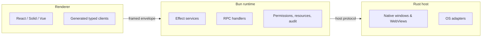

# ORIKA

Build local-first desktop apps with **Rust for the shell**, **Bun for the runtime**, **React (or your framework) for the UI**, and **Effect for correctness**.

```txt
Rust owns the shell.
Bun owns the runtime.
React owns the UI.
Effect owns correctness.
```

## What you get

- A **Rust host** that owns the native shell, WebViews, app-protocol routing, and OS adapters.
- A **Bun runtime** that owns application services, RPC handlers, jobs, storage, and telemetry.
- A **renderer adapter** for React (Solid, Vue, Next, Astro also available) that consumes typed RPC clients.
- **Permissions are deny-by-default.** Every privileged call crosses `PermissionRegistry`, emits an audit event, and has a deterministic test double.
- **Failures are tagged values**, not thrown exceptions. The renderer narrows on `_tag`.
- **Resources are scoped.** Windows, watchers, processes, PTYs, workers, jobs — all close with their owner scope.
- **A first-party CLI** for build, package, sign, notarize, publish, and reproducibility checks.
- **A headless test runtime** so you can exercise handlers without a real OS.

The renderer never receives raw native authority. Privileged work crosses named services, typed contracts, permissions, and resource lifecycles — the [boundary rule](docs/explanation/boundary-rule.md).

## Status

ORIKA is **pre-v1**. Workspace packages are `private: true` at version `0.0.0` and not yet published to npm. Develop against this repository directly.

Public APIs are stable in shape but not in version. Anything described in `docs/` is grounded in current source — if you can read it, you can grep it.

## Get started

```bash
git clone https://github.com/Rika-Labs/effect-desktop.git
cd effect-desktop
bun install --frozen-lockfile
bun run desktop --help
```

Then either:

- Read [Install](docs/start/install.md) → [Build your first app in 5 minutes](docs/start/first-app.md), or
- Run the inspector: `cd apps/inspector && bun run dev`.

## Documentation

The docs are organized as **[Diátaxis](https://diataxis.fr/)** — four content modes for four reader needs:

|                      | Practical                                                    | Theoretical                                                            |
| -------------------- | ------------------------------------------------------------ | ---------------------------------------------------------------------- |
| **Learning** (study) | [Tutorials →](docs/tutorials/) — guided walkthroughs         | [Explanation →](docs/explanation/) — why the framework looks like this |
| **Working** (apply)  | [How-to guides →](docs/how-to/) — recipes for specific tasks | [Reference →](docs/reference/) — every public symbol                   |

The [docs landing page](docs/README.md) is the full index. For LLM consumption, see [`llms.txt`](llms.txt).

## Run the framework's own checks

```bash
bun run check       # Ultracite (oxlint + oxfmt)
bun run typecheck   # tsgo across all packages
bun test            # Bun test runner
cargo check --workspace
```

`bun install` runs the repo's `postinstall` hook, which patches `@typescript/native-preview`
with `@effect/tsgo` so local `tsgo` and editor LSP diagnostics use the Effect language service.

If any of those fail on a clean clone, file an issue — it is not your machine.

## Repository map

| Path                                                                                                                                        | Purpose                                                                            |
| ------------------------------------------------------------------------------------------------------------------------------------------- | ---------------------------------------------------------------------------------- |
| [`docs/`](docs)                                                                                                                             | External documentation (Diátaxis-organized).                                       |
| [`engineering/`](engineering)                                                                                                               | Internal specifications, ADRs, plans, run logs, release evidence, roadmap records. |
| [`crates/host/`](crates/host)                                                                                                               | Rust native host and WebView shell.                                                |
| [`crates/host-protocol/`](crates/host-protocol)                                                                                             | Wire protocol shared with the runtime.                                             |
| [`crates/native-pty/`](crates/native-pty)                                                                                                   | PTY adapter.                                                                       |
| [`crates/native-updater/`](crates/native-updater)                                                                                           | Updater adapter.                                                                   |
| [`packages/core/`](packages/core)                                                                                                           | Runtime services, public framework entry.                                          |
| [`packages/native/`](packages/native)                                                                                                       | Native capability service definitions and RPC surfaces.                            |
| [`packages/bridge/`](packages/bridge)                                                                                                       | Host protocol, framing, RPC helpers, redaction.                                    |
| [`packages/react/`](packages/react)                                                                                                         | React provider and hooks.                                                          |
| [`packages/solid/`](packages/solid), [`vue/`](packages/vue), [`next/`](packages/next), [`astro/`](packages/astro), [`vite/`](packages/vite) | Framework adapters.                                                                |
| [`packages/platform-browser/`](packages/platform-browser)                                                                                   | Renderer-side IndexedDB, SQLite WASM, PGlite.                                      |
| [`packages/cli/`](packages/cli)                                                                                                             | Build, package, release, doctor commands.                                          |
| [`packages/config/`](packages/config)                                                                                                       | Configuration schema and production checks.                                        |
| [`packages/test/`](packages/test)                                                                                                           | Test layers and headless harnesses.                                                |
| [`packages/devtools/`](packages/devtools)                                                                                                   | Inspector shell and panels.                                                        |
| [`apps/inspector/`](apps/inspector)                                                                                                         | Vite + React inspector for live and recorded sessions.                             |

## Mental model in one diagram



Every privileged operation crosses a typed Effect service. Three roles, one envelope between each pair, total observability.

## Contributing

See [`CONTRIBUTING.md`](CONTRIBUTING.md) and [`AGENTS.md`](AGENTS.md). The architecture-debt sweep is part of every contribution; the [contributing docs](docs/contributing/) explain what that means in practice. Public effectful capability design is governed by [`engineering/architecture/layer-first-contract.md`](engineering/architecture/layer-first-contract.md).

## License

ORIKA is provided by Rika Labs, LLC under either the MIT license or the Apache License 2.0, at your option. See [`LICENSE`](LICENSE), [`LICENSE-MIT`](LICENSE-MIT), and [`LICENSE-APACHE`](LICENSE-APACHE).
