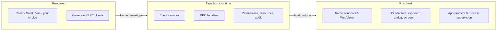

# Architecture overview

ORIKA is built on a single conviction: **a desktop app is three programs, not one**. A native shell, an application runtime, and a UI. Most desktop frameworks blur those into one process. This one keeps them strictly separate, gives each an owner language, and makes the contract between them visible.

## The three roles



| Role         | Owner                                                | Responsibility                                                                        |
| ------------ | ---------------------------------------------------- | ------------------------------------------------------------------------------------- |
| **Host**     | Rust (`crates/host`)                                 | Native windows, WebViews, app-protocol routing, OS adapters, process supervision.     |
| **Runtime**  | Bun or Node + TypeScript (`packages/core`)           | Application services, RPC handlers, resources, permissions, jobs, storage, telemetry. |
| **Renderer** | Web frameworks (`packages/react`, `solid`, `vue`, …) | UI, generated typed clients, user prompts, mutations and subscriptions.               |

The renderer **never** receives native authority. It never opens a file, spawns a process, or reads a credential. Every privileged operation crosses the runtime.

## Why this split

Desktop frameworks face a forcing question: where does the JavaScript run? Electron answers "in a Node.js process you embed in your app" and pays the cost in size, attack surface, and a single failure domain. Tauri answers "compile a Rust shell that talks to a system WebView" and pushes app logic toward Rust. ORIKA takes a third path:

- **Rust for the shell.** Tauri-style — a small native process, the only thing that holds raw OS authority. Compiled, sandboxed, hard to misuse.
- **TypeScript for the runtime.** Bun is the default runtime provider; Node is selectable when deployment policy or existing infrastructure needs it. App logic stays in TypeScript so the team that ships features doesn't have to context-switch to Rust.
- **Selectable WebView engines.** The default host uses the operating system WebView. Apps that need a pinned browser engine can choose the bundled Chrome/CEF provider and package that runtime with the app.
- **Effect for correctness.** Every effectful surface is an `Effect.Effect<A, E, R>`. Failures are typed. Resources have scopes. Concurrency is explicit. Permissions are values you can inspect and audit.

The pitch is plain: **the parts that need to be small, fast, and adversary-resistant are Rust; the parts that need to move quickly are TypeScript; the parts that need to be correct under failure are Effect.**

## Data flow

The path of a single call from a button click to a returned value:

1. The renderer calls a generated typed client method (e.g. `say.run({ name: "Ada" })`).
2. The bridge serializes a `HostProtocolRequestEnvelope` carrying method name, payload, trace id, and request id.
3. Framing prepends a length so the framed transport (stdio today; in-memory in tests) can deframe.
4. The runtime decodes the envelope, looks up the handler in the `RpcGroup.toLayer` registry, decodes the payload through Effect Schema, runs the handler, encodes the result, and frames the response.
5. The bridge resolves the original promise on the renderer side, typed exactly as the contract declared.

If anything fails, the failure is **typed** — no thrown exception crosses the wire. A `PermissionDenied`, a `WindowError`, or a custom `GreetingError` arrives as a tagged value that TypeScript has narrowed for you.

## Why everything is a contract

The renderer and runtime never share a process. They share a `RpcGroup` value:

```ts
import { Schema } from "effect"
import { Rpc, RpcGroup } from "effect/unstable/rpc"

export const SaveNote = Rpc.make("Notes.save", {
  payload: { id: Schema.String, body: Schema.String },
  success: Schema.Struct({ savedAt: Schema.Number }),
  error: NoteError
})

export const NotesRpcs = RpcGroup.make(SaveNote)
```

That value is the **single source of truth**. From it, the framework derives:

- The runtime handler signature (`RpcGroup.toLayer`).
- The bridge wire format (every payload is Schema-decoded at the boundary).
- The renderer's typed client (`useDesktop(NotesRpcs).save.useMutation()`).
- The deterministic test client (`HeadlessRuntime` provides one without hitting any real OS).
- The schema docs surfaced by `Desktop.Rpc.surface`.

Change the contract once and every consumer either updates or fails to compile. There is no silent drift.

## Where Effect shows up

Effect is not a coat of paint. It is the **lifecycle model** of the runtime:

- A `Layer<A, E, R>` produces a service `A` from dependencies `R`, possibly failing with `E`. The runtime is a composition of layers — settings, sqlite, permission registry, audit events, telemetry, native handlers.
- A `Scope` owns disposable things — windows, file watchers, processes, PTYs, workers. When the scope closes, every resource closes with it.
- A `Stream<A, E, R>` carries multi-value flows — process stdout, audit events, telemetry, devtools snapshots — with backpressure and cancellation built in.
- A `Schedule` describes retry and timing policies — used for crash retry, approval coalescing, and update polling.

The framework's job is to give you _useful starting layers_ (`PermissionRegistry`, `Settings`, `Telemetry`, …) and a discipline for assembling them. See [layer-first design](layer-first-design.md) for the rules that govern public APIs.

## Where the responsibilities live in code

| Concern                           | Lives in                                                                                      |
| --------------------------------- | --------------------------------------------------------------------------------------------- |
| Native operations                 | `packages/native/src/<service>.ts` (TS surface), `crates/host/src/<service>.rs` (Rust impl)   |
| Runtime services                  | `packages/core/src/runtime/<service>.ts`                                                      |
| Bridge envelopes                  | `packages/bridge/src/protocol.ts`, `codec.ts`                                                 |
| Renderer hooks                    | `packages/react/src/{desktop,mutation,hooks}/...`                                             |
| CLI commands                      | `packages/cli/src/<command>.ts`                                                               |
| Test layers                       | `packages/test/src/index.ts`, `native.ts` (mock host, bridge, headless runtime, native fakes) |
| Configuration & production checks | `packages/config/src/index.ts`                                                                |
| Renderer storage                  | `packages/platform-browser/src/...`                                                           |

## What this means for you

If you build an app on ORIKA, the framework asks you to do four things:

1. **Declare contracts.** Every renderer-callable surface is an `RpcGroup`.
2. **Compose layers.** Pick the runtime services you need, declare their permissions, and provide them to your handlers.
3. **Scope resources.** Anything long-lived (a watcher, a job, a worker) must have an owner scope. The framework cleans up when the scope closes.
4. **Trust types over conventions.** If TypeScript says a payload is `{ id: string }`, the bridge has already decoded it. If it says the only error is `NoteError`, that is the only error.

Everything else in this documentation is the working-out of those four ideas.

## Related

- [The boundary rule](boundary-rule.md) — why renderers never get raw native authority
- [Layer-first design](layer-first-design.md) — how public services compose
- [Permissions model](permissions-model.md) — deny-by-default, decision order, audit
- [Resource lifecycle](resource-lifecycle.md) — scopes, ownership, cleanup
