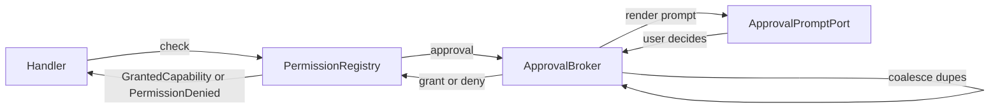

# Permissions model

Privileged operations cross `PermissionRegistry`. The registry is **deny-by-default**: anything that has not been explicitly declared as `allow`, `approval`, or `deny` returns `PermissionDenied` and never reaches the underlying adapter.

This page explains how decisions are made, how approval prompts integrate, and how audit events keep the system observable.

The registry is not a central browser/session permission manager. WebView
permission prompts for camera, microphone, notifications, geolocation,
clipboard, and display capture require a separate native service with explicit
profile/session partitioning.

## Three concepts

- **Capability** — what the call wants to do. A normalized value like `{ kind: "filesystem.write", path: "/Users/me/Documents" }`, `{ kind: "process.spawn", command: "git", args: ["status"] }`, or `{ kind: "secrets.read", namespace: "tokens" }`. Capabilities are values you can compare, log, and serialize.
- **Actor** — who is calling. A `{ kind, id }` pair like `{ kind: "window", id: "main" }` or `{ kind: "worker", id: "background-1" }`.
- **Effect** — what happens when an actor presents a capability. One of `allow`, `deny`, or `approval` (asks the user).

A **`PermissionDeclaration`** binds these three: "this capability shape, presented by this actor (or any actor), produces this effect, and emits an audit event according to this policy."

## The decision order

When a handler calls `registry.check(capability, context)`, the registry walks declarations in a fixed order. The **first match wins**:

1. **Explicit deny** — a denial wins over everything else, even if a later declaration would allow.
2. **Revoked / expired / consumed grant** — if the actor previously held a `grant` token that is no longer valid, the call fails as `PermissionRevokedError`, not as a fresh denial.
3. **Approval-denied cache** — if the user already denied this `(operation, actor, resource)`, the registry returns the cached denial without re-prompting.
4. **Approval** — the call routes through `ApprovalBroker`, which coalesces, queues, and surfaces a host-rendered prompt.
5. **Allow** — the call proceeds and a tracked `GrantedCapability` token is returned.
6. **Default deny** — no matching declaration, the call fails.

This ordering is **fixed**. There is no priority field, no precedence override, no "but in this case." If you want a narrow exception, write a narrower `allow` declaration. If you want a hard stop, write a `deny`. The order keeps decisions predictable under composition.

## Filesystem capabilities use root containment

A filesystem capability declared at root `/Users/me/Documents` authorizes any descendant path. So a single declaration covers the whole tree, but writes to `/etc/passwd` still hit default-deny. Roots are declared explicitly — no implicit "user data dir" is granted.

## Process, network, secret, and native-invoke capabilities require exact matches

Process commands, network hosts, secret namespaces, and native invoke methods do not use containment. A declaration for `process.spawn` with `command: "git"` does not authorize `command: "gh"`. This is by design: shell-shaped capabilities should be allowlisted explicitly.

## Approval flow

When a capability resolves to `approval`, control passes to `ApprovalBroker`:



The broker enforces three properties that make approval flows usable rather than infuriating:

- **Coalescing.** Identical `(operation, actor, resource)` requests share one prompt. Five concurrent file-read calls from the same window produce one user-facing question.
- **At most one visible prompt per actor.** Distinct requests queue behind it up to a configurable depth (default 8). The ninth fails as `QueueOverflow` rather than burying the user.
- **Denied-for-scope cache.** If the user denies a prompt, future identical requests fail without re-prompting until the cache is cleared.

The prompt itself is rendered by the **host**, not the renderer. `ApprovalPromptPort` is a substitutable seam — in production it is the OS-native modal; in tests it is a deterministic resolver. Renderer code never constructs an authoritative prompt. (See [why](boundary-rule.md).)

If you need to bypass the prompt for development, set `devApproveAll: true` on the broker. Approvals still emit audit events with `source: "dev-approve-all"`, so the bypass is reviewable rather than invisible.

## Grants are tokens with a lifecycle

A successful `check` returns a `GrantedCapability` token. The handler executes its privileged work via:

```ts
yield * registry.use(grant, doTheWork)
```

`use` records the use, propagates the trace id, and refuses to run if the grant is revoked or expired between issue and use. Grants have:

- An optional `expiresAt` (TTL).
- An optional `oneTime: true` flag (single-use; consumption is audited).
- An explicit `revoke(token)` path.

There is no "ambient permission" model. A grant is a value you hold, just like a file handle.

## Audit events are not optional

When an `AuditEventsApi` is provided to the registry (the default), every check writes a structured event:

- `permission/check` — the capability + actor + outcome + trace id.
- `permission/grant` — a grant was issued.
- `permission/use` — the grant was used.
- `permission/revoke` — the grant was revoked.
- `permission/expire` — the grant TTL elapsed.
- `permission/consume` — a one-time grant was used.
- `approval/requested`, `approval/granted`, `approval/denied`.

Events are redacted before they hit the event log — secret-shaped fields are replaced with `Redacted` values. The audit log is the answer to "what did this app actually do at 3:42 AM?" — and you don't have to instrument anything yourself to get it.

## Why deny-by-default

Permission systems that default to allow accumulate **silent capability creep**. Each new operation works without thought; each new actor inherits whatever scope was already granted. Six months later, no one can answer "why does this background worker have filesystem write access?"

Deny-by-default makes the question impossible to dodge. Every privilege is a declaration somewhere. Every grant has an audit trail. Every revocation takes effect immediately. The cost — declaring capabilities at startup — is a small upfront tax on the design phase that buys ongoing review-ability.

## When permissions get in your way

Two common situations:

- **"I just want to test this."** Use the test layers — they let you inject a `PermissionRegistry` that allows everything for the test scope, with audit assertions if you want them. See [How-to: write a test with layers](../how-to/write-a-test-with-layers.md).
- **"I can't predict every path the user will pick."** That is exactly when `approval` is the right effect. Declare the capability with `effect: "approval"` and let `ApprovalBroker` ask once per `(operation, actor, resource)`. The user's answer is cached.

## Related

- [The boundary rule](boundary-rule.md) — why this enforcement point exists at all
- [Audit and redaction](audit-and-redaction.md) — what gets recorded and how
- [Resource lifecycle](resource-lifecycle.md) — how grants interact with scopes
- Reference: [`PermissionRegistry`](../reference/services/permission-registry.md), [`ApprovalBroker`](../reference/services/approval-broker.md)
- How-to: [Declare a permission](../how-to/declare-a-permission.md), [Handle an approval prompt](../how-to/handle-an-approval-prompt.md)
