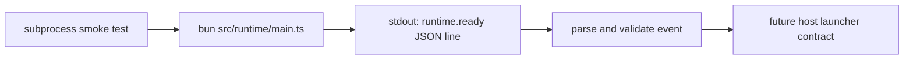

# Add a Bun runtime entry binary

## What we set out to do

Issue #29 set out to create the first canonical Bun runtime process entry in
`packages/core/src/runtime/main.ts`. The entry had one job: emit exactly one
parseable `runtime.ready` JSON line to stdout and exit zero, giving the future
host launcher a stable process contract without initializing the Effect service
graph, bridge, host supervision, heartbeats, or shutdown protocol.

## What actually ended up working

The final code kept the runtime entry as a tiny executable TypeScript file and
used `Bun.write(Bun.stdout, ...)` instead of `console.log`, preserving the
machine-output contract and satisfying the repo's `no-console` lint rule. The
ready event sources `version` from `packages/core/package.json`, so package
metadata remains the single source of truth. The subprocess smoke test executes
`bun src/runtime/main.ts` from the package root and asserts exit code, empty
stderr, one newline-terminated stdout line, JSON shape, and version parity.

The implementation also replaced the `@effect-desktop/core` Phase 0 tautology
test with a real negative assertion: the public barrel still imports to `{}`.
That kept the package honest after internal runtime code landed without making
the runtime entry part of the public framework API.

## What surfaced in review

The `/code-review` pass produced no findings, and `/address` had no review
threads or general PR comments to process. The useful review pressure happened
before code review: architecture review narrowed the work to a process contract
and rejected both premature Effect runtime initialization and public API export
surface.

## First-principles postmortem

The invariant was not "there is a TypeScript file"; it was "there is one process
entry whose stdout is safe for the host to parse." That reframed the work around
observable process behavior rather than module shape. The second invariant was
that `@effect-desktop/core` can contain internal runtime machinery before its
public `Desktop.*` facade exists. The public barrel test made that distinction
executable instead of relying on reviewer memory.

## Game-theory postmortem

The tempting local move was to print the ready event with friendly logging or to
export a helper because tests are easier to write against imported functions.
Both moves create future cost: host parsing would become brittle, and temporary
runtime scaffolding would look like supported public API. The mechanism that
aligned incentives was to test at the subprocess boundary and separately assert
the public barrel remains empty. A tired future contributor now gets a failing
test if they either add extra stdout or leak the runtime entry through the
package export surface.

## Non-obvious lesson

Internal runtime code can land before public API code only if the package has a
second executable guardrail. The repo-shape stub marker protects `src/index.ts`,
but it does not explain what should happen when non-barrel internal code becomes
real. Pairing a positive process-contract test with a negative public-barrel
test preserves both truths: the runtime entry is real, and the package's public
API is still intentionally absent.

## Reproducible pattern (if any)

When the first internal implementation lands in a still-private package:

1. Test the actual external contract at its boundary.
2. Replace the Phase 0 tautology with a real assertion about the package's
   current public surface.
3. Keep `src/index.ts` empty until the phase that owns public exports.
4. Document the internal entry without presenting it as public API.

## AGENTS.md amendment candidate (if any)

When a package gains real internal code before its public barrel exports
anything, replace the Phase 0 tautology with a real assertion that preserves the
intended public surface. Why: the existing stub-marker rule protects real barrel
exports, but internal package code needs an executable guard against accidental
public API leakage.

This is a proposal. Review and edit AGENTS.md yourself if you want to adopt it
-- `/learn` never auto-edits AGENTS.md.
