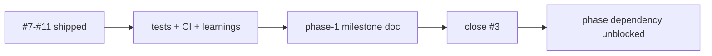

# Capture Phase 1 milestone record

## What we set out to do

The Phase 1 sub-issues had shipped, but the Phase 1 epic still lacked the durable milestone record required by `AGENTS.md` and `docs/SPEC.md` §28.4. The goal was to close the phase without changing code by adding a factual completion document for the native host spike.

## What actually ended up working

The PR added `docs/milestones/phase-1-native-host-spike.md`, mapping the shipped host binary, Tao window, WRY WebView, `app://localhost/` scheme, embedded playground assets, tests, and validation commands back to §24.1. The document deliberately records evidence instead of redesigning the phase: it names PRs #145 through #149, the finite CI host smoke path, the local OCR verification from PR #149, and the known limitations owned by later phases.

## What surfaced in review

`/code-review` produced no findings, and `/address` found no unresolved threads. The useful review pressure happened before the PR: the doc was checked against existing learning files to avoid overclaiming manual cross-platform proof that the repository did not actually have. The final wording separates CI smoke evidence, local OCR evidence, and deferred production renderer work.

## First-principles postmortem

The invariant was "a phase is not complete until its durable completion artifact exists." Closed sub-issues prove work units landed; they do not by themselves prove the phase acceptance criteria, non-goals, validation commands, and known limitations were recorded in one place. The milestone doc is the handoff object for the next phase.

## Game-theory postmortem

The local incentive is to treat an epic as automatically complete when every checkbox is checked. That creates a bad equilibrium where implementation PRs carry the real evidence, but the next engineer has to reconstruct the phase state from chat, PR bodies, and scattered learnings. Requiring a milestone doc makes the cheap move the maintainable move: close the epic only after evidence and limitations are written down.

## Non-obvious lesson

Phase epics are not just issue containers. In this repo, they are completion claims, and a completion claim needs a durable report with exact evidence and known limits. Otherwise the team can advance the dependency graph while the actual proof remains scattered across earlier PRs.

## Reproducible pattern (if any)

When the last sub-issue in a phase closes, create the phase milestone doc before starting the next phase.
Write the doc from merged evidence, not memory.
Separate CI proof, local/manual proof, and inferred limitations.
Close the phase epic through the milestone-doc PR.

## AGENTS.md amendment candidate (if any)

When all sub-issues in a phase are closed, the next issue is the phase epic until its milestone doc is merged and the epic is closed. Why: phase completion is a documented evidence claim, not just a checkbox rollup.

This is a proposal. Review and edit AGENTS.md yourself if you want to adopt it - `/learn` never auto-edits AGENTS.md.
