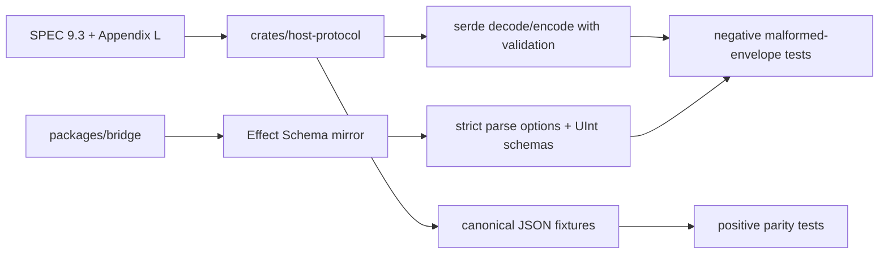

# Define host protocol envelope

## What we set out to do

The goal was to create the first canonical host-runtime wire contract for Phase 3. `crates/host-protocol` needed to own the Rust serde envelope and closed Appendix L error shape, while `packages/bridge` mirrored the same JSON contract with Effect v4 Schema and shared fixtures.

## What actually ended up working

The final implementation keeps Rust as the canonical protocol owner and uses shared crate fixtures as the positive parity surface. The implementation also had to deepen the boundary beyond derived serde and plain `Schema.Number`: stream and cancel envelopes validate their target invariant on both decode and encode, Rust rejects excess envelope and error fields with `deny_unknown_fields`, and the bridge uses strict Effect parse options plus unsigned integer schemas. The architecture still matches the issue, but the proof expanded from fixture round-trips to positive and negative boundary tests.

## What surfaced in review

Three review threads were addressed, with no pushbacks or escalations. The first found that derived Rust serialization could emit `stream` or `cancel` envelopes with neither `id` nor `resourceId`. The second found that bridge numeric schemas accepted negative, fractional, and `NaN` values that Rust unsigned integers reject. The third found that both Rust and bridge decoders accepted and stripped excess fields, which would hide protocol drift during migrations.

## First-principles postmortem

The invariant was not merely "both sides can read the fixture." The stronger invariant is "the protocol boundary rejects messages that are not in the protocol." Positive fixture parity proved the happy path, but it did not prove that malformed envelopes fail in the same way or that future wire changes become visible. The boundary became correct only after validation covered outbound construction, numeric domains, unknown fields, and closed error details.

## Game-theory postmortem

The local incentive in early protocol work is to make serializers permissive so fixtures pass and downstream code can move. That creates a bad repeated game: a future migration can add a field on one side, old code strips it, and CI stays green while the protocol has already drifted. Strict decode options, serde `deny_unknown_fields`, and negative tests make the good move cheaper by turning drift into an immediate failure.

## Non-obvious lesson

Shared positive fixtures are necessary but not sufficient for a wire protocol. A permissive decoder can round-trip every fixture and still be wrong because it normalizes invalid messages instead of rejecting them. Protocol parity needs negative tests for the values and fields each side must refuse.

## Reproducible pattern (if any)

For every new protocol envelope, add shared positive fixtures first.
Then add negative tests for illegal variant fields, numeric domains, and target invariants.
If one side has a stricter primitive than the other, encode that restriction explicitly in the mirror schema.
Treat "accepted and stripped" as a protocol failure, not a convenience.

## AGENTS.md amendment candidate (if any)

Protocol boundary work should include negative parity tests for silent normalization, invalid numeric domains, and invalid outbound construction. Why: positive fixtures alone cannot prove that drift or malformed messages fail loudly.

This is a proposal. Review and edit AGENTS.md yourself if you want to adopt it - `/learn` never auto-edits AGENTS.md.
