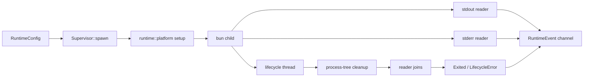

# Define crates/host runtime-supervision module

## What we set out to do

The goal was to give the native host one canonical owner for the Bun runtime child process. The supervisor needed to spawn the runtime, capture stdout and stderr as observable events, expose lifecycle state through a typed channel, and hide platform cleanup details below a narrow `runtime::platform` boundary.

## What actually ended up working

The final shape matches the locked architecture, but the ownership moved deeper than the first implementation. `Supervisor` now holds only the event receiver, termination sender, and lifecycle thread. The lifecycle thread owns the child process, platform cleanup guard, stdout reader join, and stderr reader join, so it can control shutdown order instead of leaving shutdown split across `Drop`. POSIX process groups, Linux parent-death signaling, and Windows Job Object cleanup remain hidden in `runtime::platform`. The terminal `Exited` event is emitted only after process-tree cleanup and stdio reader joins, which makes the channel contract stronger than "the direct child exited."

## What surfaced in review

Two review threads were addressed, with no pushbacks or escalations. The first found that keeping the Windows Job Object guard on `Supervisor` while joining stdio readers could hang shutdown if a descendant inherited the pipe handles. The second found that emitting `Exited` before stdout and stderr drained could make consumers miss the diagnostics that explain why the runtime exited. Both findings changed the implementation: cleanup and reader joins moved into the lifecycle thread, and tests now assert that `Exited` is terminal.

## First-principles postmortem

The invariant that mattered was not merely "the child process exits." The real invariant is "after the terminal lifecycle event, the host has reaped the runtime process tree and no later stdout or stderr diagnostics remain." Once `Exited` is treated as a terminal event by later readiness and restart logic, event order becomes part of the API. That forced process ownership, cleanup, reader draining, and terminal emission into one lifecycle owner.

## Game-theory postmortem

The local incentive was to make `Supervisor::drop` look simple by joining whatever threads it had spawned. That shape hid a bad equilibrium: the direct child could be gone, but inherited stdio handles held by descendants could make reader joins block forever or race final logs behind `Exited`. The review mechanism aligned the code with the operator's need for trustworthy terminal state, and Windows CI added a second check by exposing that a raw Job Object handle must be explicitly marked `Send` before lifecycle ownership can move across threads.

## Non-obvious lesson

A lifecycle event is a contract, not a log line. If consumers will treat `Exited` as terminal, the supervisor must prove all process-tree cleanup and diagnostic draining happened before it sends that event. Otherwise the event channel makes shutdown look deterministic while preserving races in the background.

## Reproducible pattern (if any)

For supervised child processes, put the child, platform cleanup guard, reader joins, and terminal event emission under one lifecycle owner.
Treat terminal events as API boundaries and test that no diagnostic events can follow them.
When Windows cleanup uses owned raw handles across threads, document and prove the `Send` boundary locally.

## AGENTS.md amendment candidate (if any)

When adding lifecycle channels, tests must prove terminal events are truly terminal. Why: later readiness, restart, and incident diagnostics will otherwise race the final evidence they depend on.

This is a proposal. Review and edit AGENTS.md yourself if you want to adopt it — `/learn` never auto-edits AGENTS.md.
