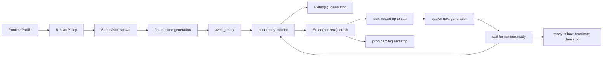

# Detect runtime crash and restart in dev only

## What we set out to do

The goal was to make post-ready runtime crashes observable and profile-aware. After `runtime.ready`, the host needed one lifecycle owner to consume runtime events, restart non-zero exits in dev with a hard cap, and log production crashes without silently respawning.

## What actually ended up working

The locked architecture held: `RuntimeProfile` validates `EFFECT_DESKTOP_PROFILE`, `RestartPolicy` carries the dev cap and restart-ready timeout, and `Supervisor` transfers the active child plus event receiver into a post-ready monitor. `spawn_runtime_child` became the single path for first spawn and respawn, preserving the platform cleanup and stdio wiring from the earlier supervisor work. The only meaningful shift was sharper failure cleanup: every branch that decides a generation has failed must terminate it before joining unless the lifecycle thread has already emitted a terminal event.

## What surfaced in review

Two review threads were addressed, with no pushbacks or escalations. Both found the same ownership bug in different branches: `StdioError` and restart-ready failure were calling `finish_runtime_child`, which only joins the lifecycle thread, even though the runtime process could still be alive. The fixes changed both paths to `terminate_runtime_child` and added regression tests for stdio failure termination and for a restarted generation that never emits ready.

## First-principles postmortem

The important invariant was not "the monitor stops after failure." The invariant is "a child process is either known terminal or explicitly told to terminate before the supervisor joins its lifecycle owner." A read error, decode error, ready timeout, or malformed ready line is evidence that supervision failed, not evidence that the runtime process exited. Treating those as equivalent creates a hidden hang under `Drop`.

## Game-theory postmortem

The local incentive was to reuse the shallow helper that made the monitor code look uniform: log the failure, finish the child, break. That makes the cheap move wrong because the helper name hides whether it terminates or only joins. The review loop forced the lifecycle state to be named more precisely: failed-but-live children go through termination; already-terminal children go through finish. The avoided bad equilibrium is future restart logic adding more failure branches that look tidy while leaving live processes owned by no active policy.

## Non-obvious lesson

Failure is not a lifecycle state unless it says what happened to the process. In a child-process supervisor, "ready failed" and "stdio failed" are diagnostic states; they do not prove exit. Cleanup code has to preserve that distinction or the host can hang exactly when it is trying to recover.

## Reproducible pattern (if any)

For every supervisor branch, classify the child before cleanup: already terminal, failed but possibly live, or shutdown-requested.
Use `finish` only for already-terminal children.
Use `terminate` for failed-but-live children, then join.
Add regression tests that make the child stay alive long enough to expose an accidental join.

## AGENTS.md amendment candidate (if any)

When adding child-process lifecycle branches, tests must prove failed-but-live children are terminated before join. Why: diagnostics like stdio failure or readiness timeout do not imply process exit.

This is a proposal. Review and edit AGENTS.md yourself if you want to adopt it — `/learn` never auto-edits AGENTS.md.
