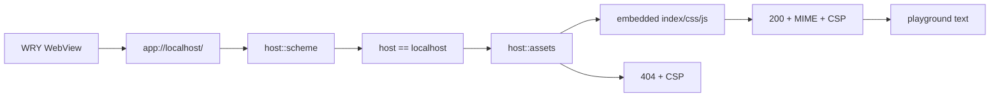

# Embed playground renderer assets

## What we set out to do

Issue #11 set out to close the Phase 1 "renderer displays text" criterion by
serving real committed renderer bytes through `app://localhost/`. The invariant
was source-tree independence: a built host binary should carry its first
renderer artifact and should not read `apps/playground/dist` from the runtime
filesystem or current working directory.

## What actually ended up working

The implementation kept the protocol handler private and pulled asset concerns
down into a new pure `host::assets` module. `apps/playground/dist` now contains
a minimal committed renderer artifact: `index.html`, `style.css`, and `app.js`.
`host::assets` embeds those files with `include_bytes!`, maps `/` to
`/index.html`, rejects traversal-shaped paths, derives the supported MIME types,
and returns `None` instead of falling back on misses.

`host::scheme` remains the WRY adapter. It now validates the request authority
is exactly `localhost`, resolves the path through `host::assets`, returns either
embedded bytes or a `404`, and attaches content type plus CSP to every response.
The CSP moved from the issue #10 no-script probe to the static spec-default
shape that allows same-origin external JS/CSS while still forbidding inline
script/style and `unsafe-*`.

Local verification also mattered: after the full repo gate passed, the built
`target/debug/host` binary was run from `/tmp/effect-desktop-host-run`, and OCR
confirmed the native WebView rendered both `Effect Desktop playground renderer`
and the hydrated `app://localhost/` text.

## What surfaced in review

Review produced one addressed finding, zero pushed back, zero escalated. The
finding was a canonical-origin bug: the first version delegated only
`request.uri().path()` to `host::assets`, so `app://other-host/style.css` could
serve the same trusted embedded bytes as `app://localhost/style.css`. Commit
`333905a` added `APP_HOST = "localhost"`, returned the same `404` response for
non-canonical hosts, and added a unit test for `app://other-host/index.html`.

The earlier PR #148 learning about exact security-exemption evidence was applied
before review this time. After PR #149 existed, the exemption row was updated to
cite PR #149 CI explicitly instead of leaving a generic issue reference.

## First-principles postmortem

The primitive concept was not "serve files"; it was "serve one trusted renderer
origin from bytes already inside the host binary." That distinction kept the
module small. A fixed embedded table was enough for the Phase 1 artifact and
avoided adding `include_dir` or a manifest format before the build pipeline
exists.

The review exposed the missing half of the origin invariant. Path validation
protects which bytes are served, but authority validation protects where those
bytes are trusted to execute. Both belong in `host::scheme`, because WRY request
translation is the adapter boundary where the raw URL still exists.

## Game-theory postmortem

The local shortcut was to think of the handler as path routing only. That makes
future origin drift cheap: a later change can point the WebView at a different
`app://` authority and still get trusted renderer bytes. Over repeated changes,
that turns the canonical origin from an enforced invariant into documentation.

The alignment mechanism is now code, not review memory. `APP_URL` names the only
startup URL, `APP_HOST` enforces its authority in the request handler, tests pin
both success and rejection, and the security exemption names the accepted scope
with exact PR evidence.

## Non-obvious lesson

An app-protocol asset handler has two independent trust checks: path and
authority. A static asset table can make path traversal harmless, but it does not
protect the single-origin invariant. The scheme adapter must validate the URL
authority before handing the path to the pure asset resolver.

## Reproducible pattern (if any)

Keep embedded asset lookup pure and table-driven until the build manifest exists.
Serve misses and rejected authorities through the same observable `404` path.
Validate authority in the protocol adapter, not in the asset resolver.
Run the built binary from outside the repo when proving embedded assets.
Update security-exemption evidence after the PR number exists, before review.

## AGENTS.md amendment candidate (if any)

When implementing an app-protocol handler, validate both URL authority and path
before serving trusted bytes. Why: path safety prevents file escape, but
authority safety preserves the single renderer origin.

This is a proposal. Review and edit AGENTS.md yourself if you want to adopt it -
`/learn` never auto-edits AGENTS.md.
