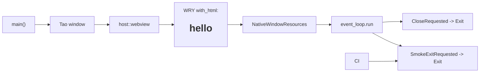

# Embed WRY WebView hello probe

## What we set out to do

Issue #9 set out to attach the first WRY WebView to the Tao host window and
load static hello content before `app://`, renderer assets, IPC, or protocol
handlers exist. The invariant was substrate isolation: prove the system WebView
pipeline works while the only moving parts are the native window, WebView
construction, static content, and close-event shutdown.

## What actually ended up working

The architectural intent held, but the issue's literal data-URL mechanism did
not. Grounding against WRY 0.55.1 showed that `WebViewBuilder::with_url`
documents data URLs as unsupported and directs callers to inline HTML instead.
The shipped code therefore adds a private `host::webview` module with
`attach_hello_webview(&Window) -> anyhow::Result<WebView>`, loads the hello
probe with `with_html`, and names the source as `inline-html` in logs and tests.

The existing `host::window` lifecycle stayed the owner of Tao event-loop state.
It now builds the Tao window, attaches the WebView, and moves both native
resources into a private `NativeWindowResources` bundle captured by the event
loop closure. The smoke path still exits through the same user event mechanism,
but now asserts `host.webview.opened` and `source="inline-html"`.

The security exemption also became part of the shipped behavior. Its scope now
accepts first WebView instantiation and static inline HTML loading, while still
excluding IPC, protocol handlers, remote content, navigation policy, permissions,
and long-lived privileged renderer behavior.

## What surfaced in review

Review produced one addressed finding, zero pushed back, zero escalated. The
finding was in the security exemption: after widening the accepted scope to
include first WebView instantiation and inline HTML loading, the validation
section still cited PR #146, whose scope was explicitly window-only. Commit
`3683a20` changed that evidence to cite PR #147, the PR whose CI actually
exercises the WebView smoke path.

This was the same mechanism learned in issue #8, but one level sharper: it is
not enough to re-review the exemption text. The evidence line must point to the
specific PR that crossed the trigger.

## First-principles postmortem

The primitive concept was not "load a data URL"; it was "prove the host can own
a system WebView rendering static content." Once WRY's source of truth said data
URLs are unsupported in `with_url`, the data-URL mechanism stopped being an
invariant and became an invalid implementation detail.

The stronger invariant was resource ownership. The window and WebView must live
for the event-loop lifetime, fail loudly if construction fails, and remain
separate from future app protocol authority. The private resource bundle made
that lifetime explicit without creating a public API.

## Game-theory postmortem

The local shortcut was to implement the issue title literally and trust that a
`data:` URL would work because it is familiar web platform behavior. That would
have created a bad equilibrium where issue text outranks grounded dependency
contracts, and first WebView failures become platform flakes later.

The alignment mechanism was grounding before code. WRY's documented limitation
forced the supported `with_html` path, and the PR body plus code comment made
the deviation reviewable. The second mechanism was evidence hygiene: the review
comment made stale validation evidence expensive, so the exemption now points at
the PR that actually broadened the accepted risk.

## Non-obvious lesson

Issue text can be directionally right and mechanically wrong. For external
substrates like WRY, the architecture should preserve the invariant and discard
the mechanism when the installed API says the mechanism is unsupported. The
durable proof is not "we followed the issue wording"; it is "we used a
supported API path and recorded exactly what behavior the PR and CI prove."

## Reproducible pattern (if any)

Ground external API shape before implementing issue wording.
Preserve the issue invariant; correct unsupported mechanics explicitly.
Hide platform-specific native construction behind one private module.
Log and assert the source kind used by smoke validation.
Tie security-exemption evidence to the PR that crosses the trigger.

## AGENTS.md amendment candidate (if any)

When an issue's implementation sketch conflicts with grounded dependency
behavior, preserve the issue invariant and document the corrected mechanism in
the PR body and code. Why: literal issue execution can reward unsupported API
paths and turn dependency-contract violations into future platform flakes.

This is a proposal. Review and edit AGENTS.md yourself if you want to adopt it -
`/learn` never auto-edits AGENTS.md.
