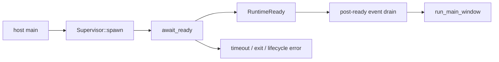

# Gate window startup on runtime ready

## What we set out to do

The goal was to make initial window creation a downstream effect of the Bun runtime's `runtime.ready` event. The host needed to spawn the staged runtime entry, parse the ready line with a bounded timeout, log readiness, and only then enter the existing native window path.

## What actually ended up working

The ready gate landed inside the existing `runtime` supervisor module instead of a new `handshake` module. `RuntimeReady` represents the accepted ready event, and `await_ready(&mut Supervisor, Duration)` consumes startup events until it sees a valid `runtime.ready` line or returns an explicit startup error. The final design also transfers the event receiver into a post-ready drain thread before the window opens, so runtime stdout, stderr, lifecycle, stdio, and exit events continue to be consumed while the window is alive.

## What surfaced in review

One review thread was addressed, with no pushbacks or escalations. The reviewer found that `await_ready` consumed only the startup prefix of the unbounded event channel; after readiness, `run_main_window` took over and no caller kept reading runtime events. That would make later runtime logs accumulate in memory for the lifetime of the process. The fix changed `await_ready` to take `&mut Supervisor`, move the receiver into a drain thread after readiness, and join that drain during `Supervisor::drop`.

## First-principles postmortem

The invariant was not only "window opens after ready." The stronger invariant is "the runtime event stream has an owner before and after ready." A startup gate that consumes exactly one event can accidentally orphan the rest of the stream. Once a channel is unbounded and single-consumer, ownership transfer is part of the lifecycle contract, not an implementation detail.

## Game-theory postmortem

The local incentive was to add the smallest wait loop in `main` and stop there because the smoke test passed. That creates a bad equilibrium where every future milestone assumes the supervisor is still observing runtime behavior, while no code is actually draining the channel. The review mechanism forced the design to name the post-ready owner, making the good move cheap: callers ask for readiness through `await_ready`, and the supervisor internally starts the drain before control reaches the window loop.

## Non-obvious lesson

Readiness is a transition, not the end of supervision. If a startup gate consumes a prefix of a live event stream, it must either hand the stream to the next owner or keep draining it itself. Otherwise a correct ordering fix can introduce a hidden liveness and memory bug.

## Reproducible pattern (if any)

For single-consumer lifecycle channels, every transition must name the next consumer.
If the first consumer waits for a sentinel event, it should transfer or drain the stream before returning.
Tests should cover both the sentinel and the post-sentinel ownership path.

## AGENTS.md amendment candidate (if any)

When adding a startup gate over a live event stream, document and test who owns the stream after the gate returns. Why: otherwise the gate can fix ordering while silently orphaning later events.

This is a proposal. Review and edit AGENTS.md yourself if you want to adopt it — `/learn` never auto-edits AGENTS.md.
