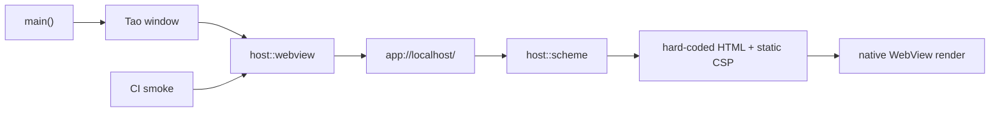

# Register app scheme handler

## What we set out to do

Issue #10 set out to replace the temporary inline WebView probe with the first
host-owned `app://localhost/` load path. The invariant was origin ownership:
renderer startup should resolve through one host-controlled protocol before
asset lookup, IPC, navigation policy, or untrusted renderer content exists.

## What actually ended up working

The shipped shape matched the reviewed architecture. `host::scheme` owns the
WRY custom protocol registration and returns a hard-coded HTML response with
`Content-Type: text/html; charset=utf-8` plus a strict static CSP. `host::webview`
now composes that builder with `with_url("app://localhost/")`, logs
`source="app-protocol"` and the canonical URL, and leaves Tao event-loop
ownership in `host::window`.

The response stays deliberately small: no filesystem lookup, no MIME detection,
no nonce generation, no IPC, and no navigation policy. Unit tests cover the
response bytes and headers, the startup smoke asserts the app-protocol log path,
CI runs that path across the platform matrix, and local manual verification
captured the native window and OCR-confirmed `app:// hello` rendered from the
WebView. WRY platform-origin parity remains future security work; this cycle
proved request routing and rendering, not the final origin model for every
platform.

## What surfaced in review

Review produced one addressed finding, zero pushed back, zero escalated. The
finding was the security exemption evidence row: after widening the exemption to
cover first `app://` custom protocol registration, the validation section said
"The issue #10 PR" instead of naming PR #148. Commit `3681df2` changed the row
to cite PR #148 CI explicitly.

That review did not change the runtime design, but it tightened the audit trail.
It repeated the PR #147 lesson in a sharper form: every exemption trigger needs
the concrete PR evidence that crossed it, not a generic issue or milestone
reference.

## First-principles postmortem

The primitive concept was not "load some HTML"; it was "make the host the owner
of the renderer origin." The useful boundary was therefore a private scheme
module with a narrow builder-transforming interface and a static response, not a
general asset server or future protocol abstraction. Pulling the protocol
handler into `host::scheme` kept WRY's closure shape and response construction
hidden while leaving `host::webview` responsible only for attaching a WebView to
the canonical URL.

The important assumption is that the first protocol milestone should minimize
authority. A working `app://` handler is already a privileged boundary, so this
PR made the allowed behavior explicit and kept all asset, path, IPC, and remote
content concerns out of scope.

## Game-theory postmortem

The local shortcut would have been to treat the custom protocol as a small
mechanical change and leave the security exemption evidence vague until later.
That creates a bad repeated-game equilibrium: each PR can widen privileged
renderer behavior a little while the durable audit record loses which CI run
proved which risk.

The alignment mechanism was exact evidence. The code logs and tests name
`app-protocol`, the exemption names the accepted and excluded behaviors, and the
addressed review comment forced the evidence row to cite PR #148. That makes the
next engineer's cheap move the safe move: extend the single handler, re-review
the explicit trigger list, and cite the exact PR when the accepted scope changes.

## Non-obvious lesson

Protocol registration is security scope even when the response is hard-coded.
The implementation can stay tiny, but the audit artifact must still move in
lockstep with the new authority boundary. A generic issue reference is weaker
than a PR reference because it records intent, not the CI-validated change that
actually widened the runtime surface.

## Reproducible pattern (if any)

Add the smallest private module that owns the new privileged boundary.
Name the source kind in logs and tests before later code depends on it.
Keep first protocol responses hard-coded until asset lookup has its own design.
When a security exemption scope changes, cite the exact PR and CI evidence.

## AGENTS.md amendment candidate (if any)

When a PR widens a security exemption, the validation row must cite the exact PR
number and CI path that crossed the trigger. Why: issue titles and milestone
names describe intent, while PR evidence identifies the reviewed runtime change.

This is a proposal. Review and edit AGENTS.md yourself if you want to adopt it -
`/learn` never auto-edits AGENTS.md.
