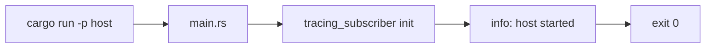

# Wire host native dependency skeleton

## What we set out to do

Issue #7 set out to make `crates/host` a real Cargo binary target with the
foundational native dependencies from the spec: `wry` for WebView, `tao` for
windowing, `tracing` for structured logs, and `anyhow` for the temporary host
error boundary. The intended runtime path was deliberately small:
`cargo run -p host` initializes tracing, emits one `host.started` event, and
exits 0 without opening a window or WebView.

## What actually ended up working

The core architecture held. `cargo run -p host` reaches `main`, initializes
`tracing_subscriber`, emits `host.started`, and exits successfully. The four
planned dependencies landed through workspace pins, and `crates/host` is now a
real binary crate.

What changed was the boundary around that behavior. Startup metadata briefly
became library API, but review pushed it back into `main.rs`; `lib.rs` now stays
intentionally empty until a later phase defines a real host API. Verification
also became stronger than planned: CI runs `cargo run -p host`, and an
integration smoke test executes the built binary and checks exit status plus
stable startup fields. ANSI styling is disabled because colored formatter output
made CI assertions brittle.

The Linux WebView stack also became explicit. WRY/TAO require GTK and WebKitGTK
development packages on Linux, so the host README documents them, and the PR
records a scoped exemption for the `glib 0.18.5` RustSec advisory pulled through
the current GTK stack.

The original mermaid still describes the runtime path:

## What surfaced in review

Review produced four actionable findings: four addressed, zero pushed back, zero
escalated. The recurring categories were contract verification, public interface
scope, operator documentation, and dependency risk.

Two findings changed the design materially. The startup-contract major turned
host startup from an inferred manual check into an automated guarantee: an
integration smoke test now validates startup, and CI runs the exact binary path.
The public API minor narrowed the crate surface back to the issue's intended
interface by keeping startup metadata private to `main`. The README minor made
local Linux setup match CI's native package assumptions. The security major
forced an explicit acceptance path for the WRY/TAO GTK dependency graph by
adding `docs/security/exemptions/2026-05-04-host-wry-gtk-stack.md`. CI then
exposed ANSI output instability, fixed with `with_ansi(false)`.

## First-principles postmortem

The invariant that mattered most was not "a host binary exists"; it was "the
canonical host binary path is real, stable, and extension-safe." Every later
host issue depends on that path being an observable contract, not a convention
inferred from package layout.

The changed assumption was that build-time shape was enough. Review forced the
design to prove runtime reality: the binary must execute, native dependencies
must be named, advisory-bearing GTK bindings must be accepted explicitly, and
startup output must be deterministic enough for CI to assert.

## Game-theory postmortem

The local incentive was to close the milestone with plausible structure:
dependencies declared, a tiny `main`, and a green local run. That incentive can
reward compile-time appearance over operational truth. Review changed the payoff
by making unverifiable claims expensive: leaked public APIs, hidden native
packages, silent advisory risk, and styled machine output all became failures to
address, not style comments to ignore.

The alignment mechanism was exact verification at the boundary. Tests and CI
stopped asking "does this look right?" and started asking "can another system
consume this deterministically?" That exposed the ANSI-colored output problem:
humans could read the log line, but the smoke test could not reliably match the
structured fields across runners.

The bad equilibrium avoided was a host path that passed locally while downstream
issues inherited hidden platform setup, hidden advisory risk, and brittle log
parsing. Future review should check public API leakage, runtime proof, native
dependency disclosure, advisory acceptance, and machine-readable output before
debating implementation shape.

## Non-obvious lesson

A native host skeleton is only real once the shipped binary path is exercised
under the same runner matrix that will own it. `cargo check` and local
`cargo run` proved compilation, but review exposed the actual contract as binary
startup, private API surface, documented OS prerequisites, explicit advisory
acceptance, and machine-stable structured output. The ANSI failure on GitHub
macOS was the sharp lesson: observability is not just "logs exist"; startup
output must be deterministic bytes that tests and CI can parse across platforms.

## Reproducible pattern (if any)

Add the native dependency graph and keep binary-only startup details private.
Document platform packages and security exemptions at the same time as the
dependency lands. Run the actual binary in CI and add a smoke test that asserts
exit code plus structured startup fields. Disable terminal styling for
machine-asserted logs.

## AGENTS.md amendment candidate (if any)

Native host startup changes must include a CI-executed binary smoke path with
ANSI-disabled, machine-assertable structured output. Why: compile-only
validation and styled logs can hide broken or runner-specific startup behavior.

This is a proposal. Review and edit AGENTS.md yourself if you want to adopt it -
`/learn` never auto-edits AGENTS.md.
