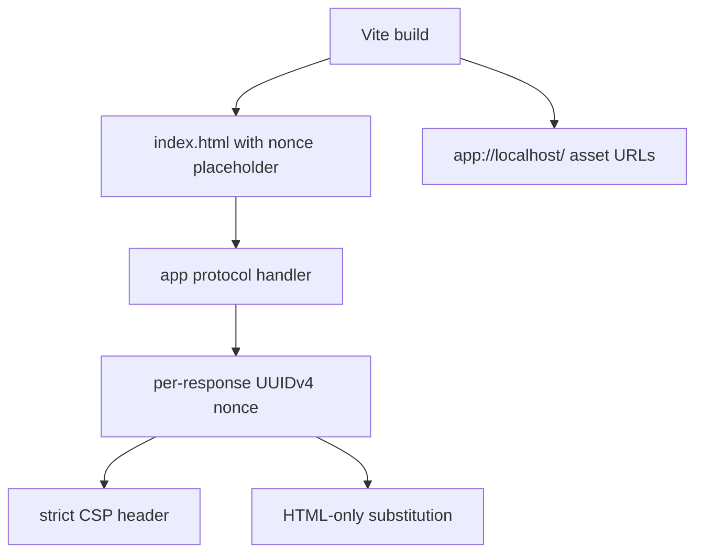

# Production CSP + asset baseUrl per §14.7 wired through the renderer build manifest

## What we set out to do

The issue asked the production `app://` handler to enforce §14.7 by default: every response gets a strict CSP with a per-request nonce, the renderer HTML carries matching nonce placeholders, and production renderer assets resolve under `app://localhost/`. Weakening checks stay tied to the later config/permissions phase.

## What actually ended up working

The working design split responsibility at the right boundary. Vite emits stable production HTML with `__APP_NONCE__` placeholders and `app://localhost/` asset URLs. The host mints a UUIDv4 nonce per app-protocol response, builds the CSP header from that nonce, and substitutes only HTML bodies before returning the response. Static JS/CSS bytes remain untouched.

## What surfaced in review

There were no GitHub review threads. Local review kept the Phase 16 production checker out of scope and avoided mutating non-HTML assets. Clippy caught one test style issue, which was fixed before the PR was opened.

## First-principles postmortem

The key invariant is that production HTML is not the final security artifact; the served response is. A committed renderer build can contain a placeholder because the host owns the request boundary where the nonce is minted. That keeps the nonce fresh without requiring a new renderer build per request.

## Game-theory postmortem

The risky local incentive is to solve CSP in the bundler because the placeholder appears in HTML. That would produce a stable nonce and create a false sense of protection. Keeping nonce minting in the host aligns the mechanism with the attacker model: every request crosses the host boundary, so every response can get fresh policy data without trusting app code.

## Non-obvious lesson

For CSP-backed desktop renderers, the build output should carry symbolic nonce slots, not nonce values. The protocol handler is the only place that can both mint a fresh nonce and guarantee the header/body pair matches at serve time.

## Reproducible pattern (if any)

Let the bundler emit deterministic placeholders.
Let the host substitute request-scoped security values.
Mutate only the content type that owns the placeholder.
Keep config weakening checks in the config phase, not in the asset server.

## AGENTS.md amendment candidate (if any)

For renderer security values that must be request-scoped, put the minting and substitution in the protocol handler rather than the bundler; Why: build-time values cannot provide per-request freshness.

This is a proposal. Review and edit AGENTS.md yourself if you want to adopt it — `/learn` never auto-edits AGENTS.md.
