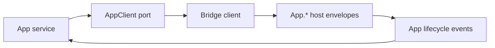

# App service - getInfo, quit, focus, registerProtocol

## What we set out to do

Issue #15 asked for the Phase 7 App lifecycle surface: metadata, command line, quit/restart/focus, single-instance, autostart, protocol registration, and app lifecycle event streams. The issue text included OS-backed implementations for locks and autostart, but the safe current milestone was the typed native contract and bridge boundary because the host dispatcher does not yet expose App platform methods.

## What actually ended up working

The merged shape is an `@effect-desktop/native` App service with a narrow `AppClient` port, an `AppApi` bridge contract, schema classes for every input/output/event payload, and public service helpers that keep zero-argument `quit` and `restart` ergonomic. Bridge adapters decode plain option objects into Effect Schema class instances before sending envelopes, so malformed inputs become `HostProtocolInvalidArgumentError` values instead of thrown exceptions. Early test fixtures used `makeUnsupportedAppClient` for host methods that were not implemented yet; later public-surface cleanup removed unsupported client factories from the package root so they no longer read as supported SDK entry points.

## What surfaced in review

There were no PR review comments or review threads. Local verification did surface one design issue before push: Effect Schema classes do not accept plain objects at the generic bridge-client boundary. The fix was to keep plain objects at the public service edge and explicitly decode them inside the App bridge adapter, preserving typed failures and envelope encoding.

## First-principles postmortem

The invariant was that App lifecycle calls must cross process boundaries as schema-validated data, and failures must remain inspectable Effect values. The assumption that changed was scope: a typed service contract can be correct before the host has real OS implementations, but only if missing host behavior is explicit and typed. The clearer primitive is the port: `App` owns the caller-facing contract, `AppClient` owns substitution, and bridge decoding owns host-envelope validity.

## Game-theory postmortem

The bad equilibrium was pretending platform behavior existed because the TypeScript method names existed. That would incentivize app authors to rely on calls whose host side would fail as method-not-found surprises. The alignment mechanism was an unsupported client that makes deferred host work explicit, plus tests that assert failures arrive through Effect instead of thrown exceptions. Future review should check every new native service for this same split: public service ergonomics, bridge schema-class construction, and explicit unsupported values for unwired host behavior.

## Non-obvious lesson

Effect Schema classes are useful as contract payloads, but the bridge boundary cannot assume callers pass class instances. Public services should accept plain option objects, then adapters should decode those objects into schema classes immediately before transport. That keeps the user-facing API simple while preserving strict host-protocol encoding and typed error values.

## Reproducible pattern (if any)

For each native service contract:

1. Define schema classes for host inputs, outputs, and event payloads.
2. Keep the public service API ergonomic with plain options where useful.
3. Decode at the bridge adapter edge and map schema errors to `HostProtocolInvalidArgumentError`.
4. Model unwired host methods with typed unsupported failures, not throws or silent fallbacks.

## AGENTS.md amendment candidate (if any)

For native service contracts, public methods may accept plain option objects, but bridge adapters must decode them into Effect Schema classes and return schema failures as `HostProtocolInvalidArgumentError` values. Why: this preserves ergonomic APIs without weakening the host-protocol contract.

This is a proposal. Review and edit AGENTS.md yourself if you want to adopt it - `/learn` never auto-edits AGENTS.md.
