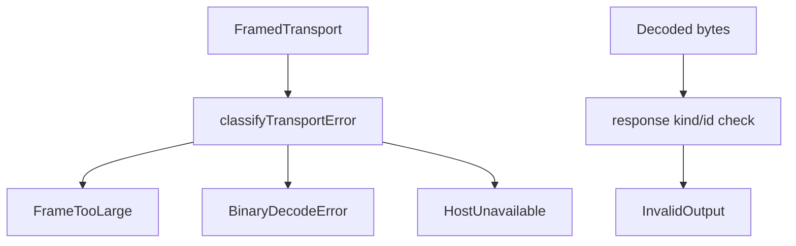

# Bridge failure modes per §10.8: typed errors for transport disconnect, malformed frame, version mismatch

## What we set out to do

The host protocol exchange needed to preserve wire-level failure causes as typed `HostProtocolError` values. The risky behavior was a broad transport catch that collapsed frame size, truncation, malformed bytes, and peer availability into one generic host-unavailable path.

## What actually ended up working

The smallest useful seam was the Bun host-client boundary. The protocol already had closed error classes for `FrameTooLarge` and `BinaryDecodeError`, so the PR added narrow factory helpers and a private classifier in `packages/core/src/runtime/host-client.ts`. Oversized frames now become `FrameTooLarge`, truncated frame reads and malformed JSON/envelopes become `BinaryDecodeError`, closed/unavailable peers remain `HostUnavailable`, and semantic response mismatches stay `InvalidOutput`.

## What surfaced in review

`/code-review` found no issues. Blacksmith passed on Ubuntu, macOS, and Windows before this learning commit. The useful review pressure was in the architecture pass: do not build a reconnect state machine in this slice when the concrete missing behavior was classification at the exchange boundary.

## First-principles postmortem

The invariant is that a component must classify the failure while the evidence is still present. Once an exception crosses a broad `catch`, the caller can no longer tell whether the bytes were oversized, truncated, malformed, or whether the host disappeared. The host-client boundary is deep enough to hide the exception classes while preserving the typed cause.

## Game-theory postmortem

The bad local incentive is to write one catch block and call it reliability. That makes the code short but pushes cost to app authors, who either retry non-retriable corrupt data or stop retrying recoverable transport loss. A small classifier changes the payoff: adding a new transport failure now has an obvious typed branch and a focused regression test.

## Non-obvious lesson

Malformed protocol bytes are not the same failure as a decoded response with the wrong id. The former belongs to `BinaryDecodeError`; the latter is a semantic contract failure and should remain `InvalidOutput`. Keeping that distinction lets recovery policy follow the real boundary: bytes versus decoded envelope semantics.

## Reproducible pattern (if any)

Classify errors at the boundary that still has concrete evidence.
Use protocol factories to hide common-field construction.
Keep semantic validation after decode separate from byte/protocol decode.

## AGENTS.md amendment candidate (if any)

When mapping external or transport failures, classify before broad catch blocks erase concrete evidence; Why: typed recovery policy depends on the original failure category.

This is a proposal. Review and edit AGENTS.md yourself if you want to adopt it — `/learn` never auto-edits AGENTS.md.
