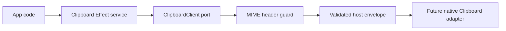

# Clipboard service contract

## What we set out to do

Issue #21 asked for a typed Clipboard service for text and image read/write, with
schema-validated I/O and MIME guards for PNG/JPEG payloads. The important
invariant was that declared image MIME and actual bytes must agree before the
payload crosses the host boundary.

## What actually ended up working

The implementation follows the Dialog pattern: concrete clipboard schemas live
in `packages/native/src/contracts/clipboard.ts`, while
`packages/native/src/clipboard.ts` owns the Effect service, client port, bridge
adapter, unsupported client, and MIME-header guard. `writeImage` decodes the
payload, validates the PNG/JPEG magic bytes with a pure predicate wrapped in
`Effect`, and only then sends the typed host envelope.

## What surfaced in review

No review threads were opened. The local code-review pass focused on Effect
error-channel discipline and the failure boundary: malformed image data returns a
typed `InvalidArgument` value before transport, and deferred host behavior
returns typed `Unsupported`.

## First-principles postmortem

The primitive concept is not "clipboard image"; it is "bytes plus a claim about
their format." The claim is untrusted input. Validating it at the bridge adapter
keeps the host adapter from inheriting corrupted state and keeps app code from
observing a successful write that no recipient can decode.

## Game-theory postmortem

Without a guard, the cheapest local move would be to pass bytes through and let
each platform adapter decide what it means. That creates a bad equilibrium where
platform quirks become the source of truth. The guard changes the payoff: the
contract becomes the source of truth, bad payloads are loud, and native adapters
can assume the declared MIME already survived validation.

## Non-obvious lesson

Schema validation proves the shape of binary payloads, not their semantic
truth. When a contract includes a declared MIME or similar self-description, the
service needs a small pure validator for the claim itself before transport.

## Reproducible pattern (if any)

For binary payload contracts:

- use schemas for transport shape;
- add pure validators for semantic claims that schemas cannot prove;
- wrap validator failures in typed `InvalidArgument` errors;
- test that invalid payloads do not dispatch host requests.

## AGENTS.md amendment candidate (if any)

For binary payload contracts, validate semantic claims such as MIME headers before
transport. Why: schema shape alone cannot prove that bytes match their declared
format.

This is a proposal. Review and edit AGENTS.md yourself if you want to adopt it —
`/learn` never auto-edits AGENTS.md.
