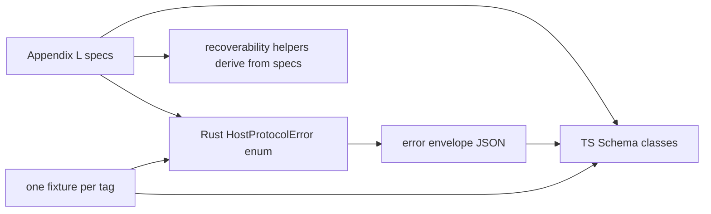

# Closed HostProtocolError enum

## What we set out to do

Issue #61 set out to replace ad-hoc host error strings with the closed Appendix L `HostProtocolError` contract. The invariant was that every host-returned error has a known tag, documented recoverability default, serde shape in Rust, Schema shape in TypeScript, and fixture evidence that both runtimes decode the same wire envelope.

## What actually ended up working

The final implementation keeps the planned architecture but deepens the registry role. `crates/host-protocol::error` owns the closed enum, exported tag specs, metadata fields, constructor helpers, and fixture round trips. `packages/bridge/src/protocol.ts` mirrors the same tag set as Schema classes with `_tag` getters so Effect recovery can use `catchTag`. The important adjustment was making the exported spec tables the authority for recoverability defaults instead of leaving helper switches as parallel sources of truth.

## What surfaced in review

The local `/code-review` pass found one major issue: recoverability defaults were duplicated outside the exported Rust and TypeScript spec registries. That was addressed by deriving the helper defaults from the spec tables and adding parity tests. The GitHub Codex review found one P1 issue: `SettingsMigrationFailed.cause` was `serde_json::Value` in Rust while the bridge schema expected a string. That was addressed by aligning Rust to the string contract and resolving the thread. No review comments were pushed back or escalated.

## First-principles postmortem

The core invariant was closed-contract parity. A tag registry is not closed if the tag list, recoverability defaults, variant fields, and decoder classes can drift independently. The first implementation had the right enum shape but still allowed two hidden splits: spec table versus helper defaults, and Rust cause type versus TypeScript cause type. The correct primitive is a manifest-backed contract: tables describe facts, constructors and helpers read those facts, and fixtures prove the wire form.

## Game-theory postmortem

The local incentive was to finish the large enum by copying the same facts into the places that needed them. That is cheap in the moment and expensive in the repeated game because future tag edits reward updating only the line near the failing compiler error. Review changed the payoff by making drift a named invariant violation. The CI runner migration added a second mechanism lesson: hosted-runner identity is part of the test environment, and native GUI tests must declare which OS jobs can actually present a GUI-backed proof.

## Non-obvious lesson

A closed enum is only closed at the authority boundary. If the registry is exported but helper defaults or cross-runtime field types live in separate tables, reviewers and future edits inherit multiple plausible sources of truth. The durable move is to derive behavior from the registry where possible and make fixture parity cover the wire contract, not just the happy-path constructor output.

## Reproducible pattern (if any)

For closed cross-runtime contracts, keep the manifest as the authority and derive helpers from it.
Use one fixture per tag to prove both decoders accept the same wire shape.
When CI moves to a different runner provider, classify native smoke tests by real environment capability, not just operating system name.

## AGENTS.md amendment candidate (if any)

For cross-runtime closed registries, helper defaults must derive from the exported registry or have direct parity tests against it. Why: copied defaults create multiple authorities that future tag edits can drift across.

This is a proposal. Review and edit AGENTS.md yourself if you want to adopt it — `/learn` never auto-edits AGENTS.md.
