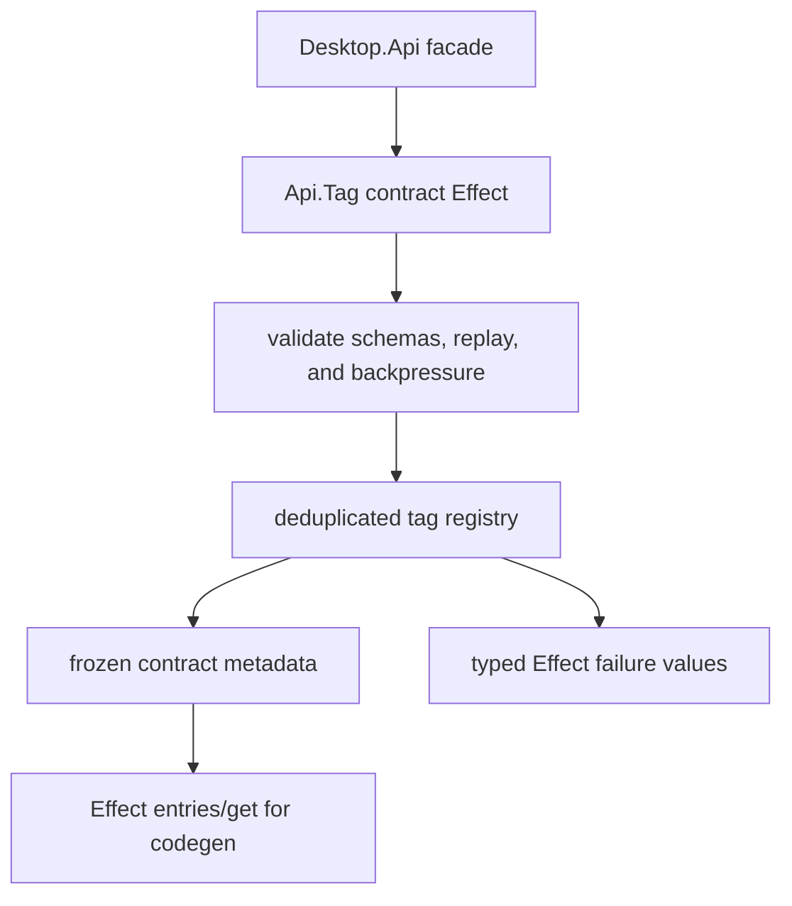

# Desktop.Api.Tag contract registry

## What we set out to do

The goal was a single registry for API contracts declared through `Desktop.Api.Tag`, deduplicated by tag and frozen before codegen reads it. The issue framed duplicate registration and mutable snapshots as the core risks: service authors should not be able to publish two shapes under one tag, and codegen should not observe half-applied contract state.

## What actually ended up working

The shipped shape keeps the registry invariant but moves the registration boundary into Effect. `Api.Tag(name)<Self>()(spec)` returns an `Effect` that validates schemas, validates replay/backpressure metadata, fails with typed registry errors, freezes the contract class/spec, and records it in the module-local map. `entries()`, `get()`, and `freeze()` are also Effect programs, so callers do not need a throwing read/write path to interact with the registry.

## What surfaced in review

Six comments were addressed: backpressure overflow literals now match `docs/SPEC.md`, layer handlers are typed as schema-derived functions returning `Effect`, handler maps are frozen when descriptors are built, invalid backpressure values fail as `InvalidApiContractSpec`, `cachedResultMs` is part of method metadata, and JavaScript/casted boolean flags are validated before registration. Two comments remained unresolved by design: restoring the constructible `class extends` form would reintroduce a synchronous boundary that cannot return duplicate/frozen/invalid failures as values, and returning a real Effect `Layer` is handler runtime wiring rather than the registry primitive in this issue.

## First-principles postmortem

The invariant that mattered most was not "contracts are classes"; it was "contract registration is observable, deduplicated, immutable, and fail-fast without hidden control flow." A class `extends` API is easy for module declarations but forces failure into JavaScript's synchronous exception channel. The moment typed failure values became the stronger constraint, registration had to become an Effect program and the class became registered data returned by that program.

## Game-theory postmortem

The local incentive was to preserve the spec's author-facing syntax even when it pushed errors into throws. That creates a bad equilibrium: contributors keep the pretty declaration shape, then every later codegen/runtime path has to special-case defects that should have been typed failures. The mechanism that improved alignment was making tests assert `Exit` failures and reviewing the handler surface against the spec, so mistakes became type errors or `InvalidApiContractSpec` values instead of runtime surprises.

## Non-obvious lesson

An Effect-first registry cannot honestly expose a constructible synchronous declaration API if registration can fail. The design must choose: class syntax with thrown load-time failures, or Effect registration with typed failures as values. For this repo, typed failure values are the stronger invariant.

## Reproducible pattern (if any)

When a spec shows class syntax but the operation can fail, identify the failure channel before implementing the facade.
Keep the synchronous surface only for pure construction.
Put registration, deduplication, freeze gates, and validation in `Effect`.
Test expected failures with `Effect.runPromiseExit`, not `toThrow`.

## AGENTS.md amendment candidate (if any)

For Effect-owned public APIs, do not implement class-style or synchronous facades for operations that can validate, deduplicate, freeze, allocate, or otherwise fail; Why: those operations need typed Effect failures rather than thrown module-load errors.

This is a proposal. Review and edit AGENTS.md yourself if you want to adopt it -- `/learn` never auto-edits AGENTS.md.
