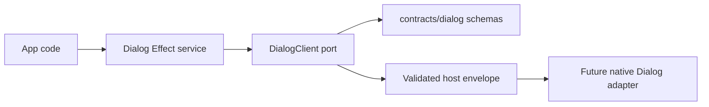

# Dialog service contract

## What we set out to do

Issue #19 asked for a typed Dialog service for native open-file,
open-directory, save-file, message, and confirm dialogs. The invariant was that
dialog interactions are Effect calls with schema-validated I/O, where selected
paths are success values and cancellation or host failures remain typed failures.

## What actually ended up working

The implementation split concrete dialog schemas into
`packages/native/src/contracts/dialog.ts`, matching the §18.6 rule for this
primitive group, and kept orchestration in `packages/native/src/dialog.ts`. The
service presents ergonomic success values (`string[]`, `string`, `boolean`) while
the client port preserves the protocol result objects used by the bridge. Host
work remains deferred through an explicit unsupported client, so app code cannot
mistake an unwired adapter for successful behavior.

## What surfaced in review

No review threads were opened. The local code-review pass checked the schema-file
placement, Effect error-channel discipline, pre-transport validation, and test
coverage for service delegation, host-envelope decoding, malformed input, and
explicit `Unsupported` behavior.

## First-principles postmortem

The useful separation was between the app-facing success shape and the bridge
contract shape. App code should not carry protocol wrapper objects just because
the host needs named output schemas. The service can strip those wrappers while
the client port and bridge keep the full typed contract.

## Game-theory postmortem

Without a schema-file convention, future primitive contracts would be tempted to
copy whichever adjacent module is closest. Placing Dialog schemas under
`contracts/dialog.ts` changes the local incentive for the §18.6 primitive group:
new methods have an obvious home for concrete schema rows, and reviewers have a
single file to inspect for contract drift.

## Non-obvious lesson

For primitives whose spec requires contract files, the deep module is a pair: a
contract file for stable data rows and a service file for Effect wiring. Keeping
those separate prevents bridge schemas, public ergonomics, and deferred host
implementation state from collapsing into one broad module.

## Reproducible pattern (if any)

For §18.6 native primitive groups:

- put concrete `Schema.Class` rows in `packages/native/src/contracts/<primitive>.ts`;
- keep the Effect service, client port, bridge adapter, and unsupported client in
  `packages/native/src/<primitive>.ts`;
- return ergonomic success values from the public service;
- keep cancellation and host/platform failures in the typed error channel.

## AGENTS.md amendment candidate (if any)

For primitives covered by the §18.6 contract-file rule, put concrete method
schemas under `packages/native/src/contracts/<primitive>.ts`. Why: it gives
future service slices one source of truth for bridge contract rows.

This is a proposal. Review and edit AGENTS.md yourself if you want to adopt it —
`/learn` never auto-edits AGENTS.md.
