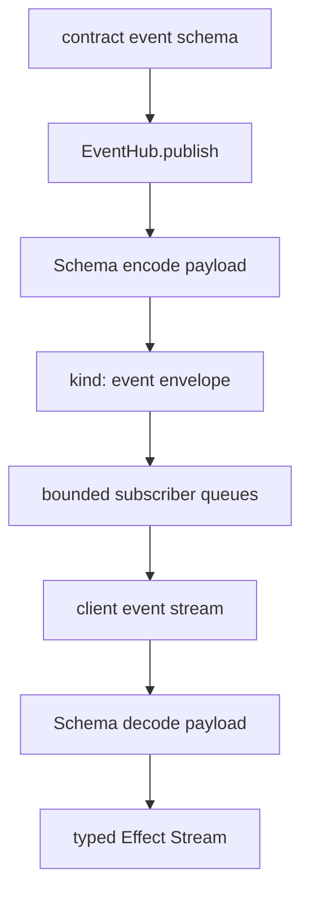

# Events: bridge to renderer push channel with deterministic delivery semantics

## What we set out to do

Issue #115 set out to make runtime-to-renderer push events part of the typed bridge instead of a stringly side channel. The intended invariant was that events are contract-declared, schema-encoded by the runtime publisher, schema-decoded by the renderer client, and delivered in deterministic order through a renderer-side Effect `Stream`.

## What actually ended up working

The shipped bridge adds an `events` map beside method specs on every API contract. `Api.Tag(...)(methods, events)` validates and freezes event payload schemas and backpressure metadata, while preserving the concrete event keys in the returned contract type. `Client(...)` now exposes `client.<api>.events.<name>` as a typed `Stream<Payload, HostProtocolError, never>`. `EventHub` owns the in-process publish/fanout primitive: it encodes payloads through the contract event schema, emits `HostProtocolEventEnvelope` values, and feeds per-event subscriber queues.

## What surfaced in review

Two review threads were addressed and resolved. First, the initial subscriber implementation used dropping queues by default, which meant slow consumers could lose events silently even when the contract intended buffering or blocking. The fix makes bounded blocking delivery the default and returns a typed `BackpressureOverflow` when a configured `dropNewest` queue refuses a frame. Second, `Api.Tag` initially accepted `events` as `ApiContractEvents`, which widened concrete keys to a string-indexed map and erased `client.<api>.events.<name>` precision. The fix makes event metadata generic and adds a type-preservation assertion through `Client`.

## First-principles postmortem

The invariant was not "events exist"; it was "declared event metadata controls the runtime behavior and renderer type." If event metadata is only checked at registration but ignored by the queue implementation, the contract lies. If event keys are widened during registration, the generated-looking client surface becomes typed in name only.

## Game-theory postmortem

The local shortcut was to use the queue primitive that made tests pass and to type the event argument with the broad interface that was easiest to validate. Both moves reward quick implementation while hiding costs from future service authors: event-driven state can become lossy without consent, and precise event names disappear before client generation sees them. The review mechanism made the cheap move align with the desired equilibrium by forcing queue behavior and type behavior to come from the same contract data.

## Non-obvious lesson

Contract metadata is policy, not decoration. Once an API lets authors declare backpressure or event names, the runtime must either honor those declarations or reject them as unsupported. A broad interface type can be just as damaging as a broad runtime fallback because it erases the facts downstream code needs to stay typed.

## Reproducible pattern (if any)

Keep contract declaration generics concrete until the generated/client surface has consumed them.
Make default queue behavior lossless; require explicit typed policy for loss.
Add a type-level assertion when a feature depends on preserving literal keys through registration.
Treat silent event loss as a typed backpressure failure unless a later spec explicitly models audited dropping.

## AGENTS.md amendment candidate (if any)

When contract metadata declares queue, backpressure, event, or stream policy, tests must prove the runtime behavior and public TypeScript type both preserve that metadata; Why: otherwise the contract becomes documentation rather than an enforced source of truth.

This is a proposal. Review and edit AGENTS.md yourself if you want to adopt it — `/learn` never auto-edits AGENTS.md.
