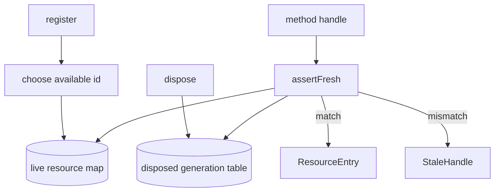

# Generation-stamped Handle<R> shape with StaleHandle failure mode on use after dispose

## What we set out to do

Issue #81 asked for generation-stamped resource handles and one registry-owned `assertFresh` check so runtime or native methods can reject stale `(kind, id, generation)` tuples. The target invariant was that a disposed handle never resolves to live state again, while rare reusable resource kinds can opt in to generation bumps across ID reuse.

## What actually ended up working

The final registry exports a serializable handle schema, a `StaleHandle` schema error, and `assertFresh(handle)`. Normal resources become permanently stale after disposal with `actualGeneration: -1`. Reusable IDs carry the next generation forward only when the same kind opts in with `reusableId: true`. The review pass added two important guards around the explicit-ID path: ineligible disposed IDs receive a non-matching generation, and duplicate live IDs are not overwritten.

## What surfaced in review

Three review threads were addressed and none were pushed back. Two caught the same non-reusable ID resurrection risk: re-registering a consumed ID at generation `0` could make an old disposed handle fresh. Another caught that caller-supplied duplicate live IDs could overwrite an existing entry and skip cleanup. Both findings changed the final registration mechanism from a simple `Map.set` to an atomic `SubscriptionRef.modify` that chooses an available ID before inserting.

## First-principles postmortem

Generation is not metadata on a handle; it is part of the resource identity. The registry must protect identity even for paths that look test-only, such as caller-supplied IDs. Once explicit IDs entered the interface for reusable-resource tests, registration also had to own uniqueness and generation allocation. Otherwise stale detection depended on caller discipline, which is the failure the feature exists to prevent.

## Game-theory postmortem

The local incentive was to add a small `id` hook so reusable ID tests were easy. That hook changed the game board: future code could cheaply bypass UUID allocation and accidentally overwrite live resources or resurrect stale handles. The corrected mechanism makes the safe move cheaper by centralizing ID availability and generation choice inside `register`. Future review should treat any test hook that crosses an identity boundary as production surface until proven otherwise.

## Non-obvious lesson

A stale-handle checker is only as strong as the allocator that creates the next handle. It is not enough for `assertFresh` to compare `(kind, id, generation)`; `register` must also guarantee it never creates a new live tuple that an old handle can satisfy. Validation and allocation are one contract.

## Reproducible pattern (if any)

When adding generation-stamped identity:

1. Test stale lookup after normal disposal.
2. Test allowed reusable-ID generation bumps.
3. Test ineligible ID reuse cannot refresh the old handle.
4. Test duplicate live IDs do not overwrite existing resources or skip cleanup.

## AGENTS.md amendment candidate (if any)

When a feature adds validation for stale identity, review the allocator in the same pass; Why: a validator can be locally correct while the allocator creates a future tuple that makes stale data valid again.

This is a proposal. Review and edit AGENTS.md yourself if you want to adopt it -- `/learn` never auto-edits AGENTS.md.
