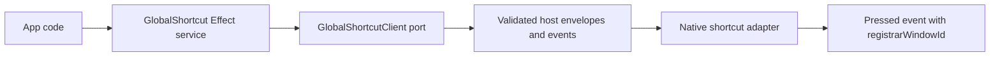

# GlobalShortcut service - register/unregister with conflict detection

## What we set out to do

Issue #52 asked for a Phase 8 `GlobalShortcut` service for app-level keyboard
shortcuts that can work while the app is unfocused. The important behavior was
not just the method names: support probing, platform unavailability, duplicate
registration, and pressed callbacks all needed typed boundaries so apps do not
mistake a missing host capability for a successful registration.

## What actually ended up working

The shipped shape follows the native service contract pattern already used by
Menu, Tray, Dock, and the OS-state services. `packages/native/src/contracts/`
owns the bridge schemas, while `packages/native/src/global-shortcut.ts` owns the
Effect service, client port, bridge client, unsupported client, and typed
`AlreadyExists` helper for duplicate accelerator registration. `isSupported`
keeps the diagnostic result wrapper because callers need the reason, while
`isRegistered` unwraps to a boolean for the public service.

## What surfaced in review

The local `/code-review` pass found no issues. The GitHub Codex review found one
valid mismatch: the generic unsupported client returned
`host-adapter-unimplemented` from `isSupported`, but command failures used the
Wayland-specific `wayland-no-global-shortcut` reason. `/address` changed the
unsupported command and event failures to use the same generic reason and added
a regression assertion.

## First-principles postmortem

The core invariant was that diagnostic information must describe the boundary
that actually failed. Wayland portal absence is a native platform fact; a
missing TypeScript host adapter is a framework integration fact. Both are
`Unsupported`, but they are not the same reason, and merging them would make the
error value less truthful.

## Game-theory postmortem

The bad local move is to reuse a familiar platform reason anywhere an
unsupported shortcut path appears. That makes the code easy to write, but it
pushes cost onto app authors, telemetry, and support flows that need to know
whether the app is on unsupported Wayland or the framework has no adapter wired
yet. Keeping support probes and command failures reason-aligned makes the cheap
move the correct one: future unsupported clients can copy one diagnostic story
instead of inventing divergent strings.

## Non-obvious lesson

The error tag is not enough when the user-facing recovery differs. `Unsupported`
answers "what class of failure happened"; the reason answers "what should the
caller do next." If two unsupported paths imply different recovery, their reason
values must stay distinct even when they share the same error tag.

## Reproducible pattern (if any)

- Keep `isSupported()` diagnostic reasons and command failure reasons aligned
  for the same fallback path.
- Reserve platform-specific reasons for platform adapters that actually observed
  that platform condition.
- Add tests that inspect typed error payload fields, not only error tags, when
  recovery depends on the payload.

## AGENTS.md amendment candidate (if any)

When a native service exposes `isSupported()` with a diagnostic reason, test that
unsupported command failures use a reason with the same source of truth. Why:
the error tag gives the failure class, but the reason drives recovery and
telemetry.

This is a proposal. Review and edit AGENTS.md yourself if you want to adopt it -
`/learn` never auto-edits AGENTS.md.
