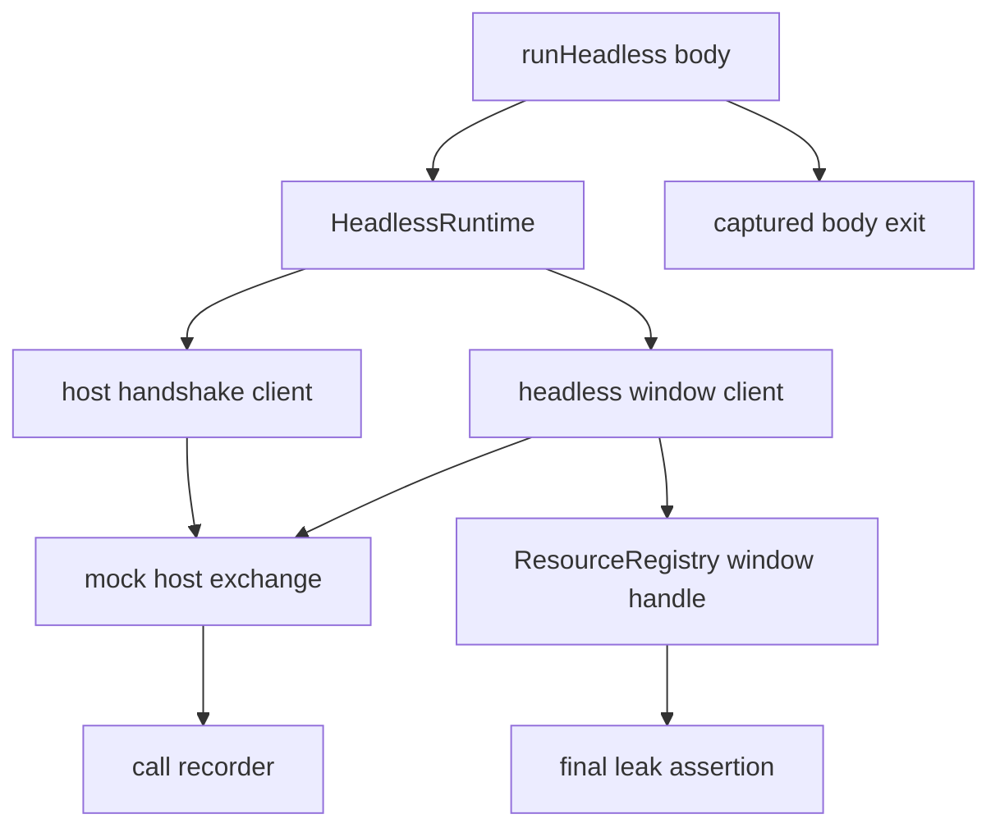

# Headless harness in @effect-desktop/test: drive the runtime in CI without a window or WebView

## What we set out to do

The issue asked for a no-WebView test harness so Phase 4 bridge tests can drive host protocol behavior in CI. The important invariant was that a smoke path can call host handshake and window methods, record the calls, and fail on leaked resources without booting a native window.

## What actually ended up working

The shipped `runHeadless` is a test harness boundary rather than a full runtime bootstrap, because the repo does not yet have a public `Desktop.run` or runtime layer API to compose. It creates a mock host exchange, exposes handshake and window clients, records every protocol request, supports per-method fixtures, and registers fake windows in the ResourceRegistry. The harness runs the body, always runs the leak check, and returns or fails with the original Effect cause shape. `@effect-desktop/test` now depends on `@effect-desktop/bridge` because the harness intentionally reuses the real bridge clients and protocol envelopes.

## What surfaced in review

Two review threads were addressed and resolved. First, `runHeadless` originally skipped leak detection when the body failed; the fix captures the body `Exit`, runs the leak assertion regardless, then re-fails from the captured cause. Second, the first window cleanup used `Effect.orDie(rawWindow.destroy(...))`, which converted typed host protocol destroy failures into defects. The fix keeps registry cleanup no-op and makes `runtime.window.destroy` call the mock host directly so expected destroy failures remain typed.

## First-principles postmortem

The harness owns two separate contracts: test cleanup must always run, and host protocol errors must stay typed. Cleanup is a finalizer concern; it cannot depend on the happy path. Protocol failure shape is a caller contract; converting it to a defect makes tests less able to assert behavior. The clean split is that the registry tracks fake window lifetime, while the window client owns destroy protocol semantics.

## Game-theory postmortem

The local shortcut was to put the mock host destroy call inside resource cleanup because it made open/close look symmetrical. That hides typed errors behind a cleanup path where the easiest implementation is `orDie`. The review mechanism moved the responsibility back to the explicit `window.destroy` API, where callers can observe and assert host failures. Future harnesses should keep final cleanup boring and put protocol behavior on the public operation under test.

## Non-obvious lesson

Test harness code is part of the product's error contract. If it turns expected typed failures into defects, downstream tests learn the wrong system. A harness should make failure modes easier to observe, not normalize them away.

## Reproducible pattern (if any)

Capture the body exit, run harness cleanup or leak checks, then re-emit the appropriate cause.
Keep protocol calls on explicit client methods, not hidden resource finalizers.
Add fixture-driven failure tests for every mock operation that can return a typed error.

## AGENTS.md amendment candidate (if any)

When a test harness mocks an effectful service, add at least one fixture-driven typed-failure test for each mocked operation family. Why: harnesses that only prove success paths can silently convert expected errors into defects.

This is a proposal. Review and edit AGENTS.md yourself if you want to adopt it -- `/learn` never auto-edits AGENTS.md.
