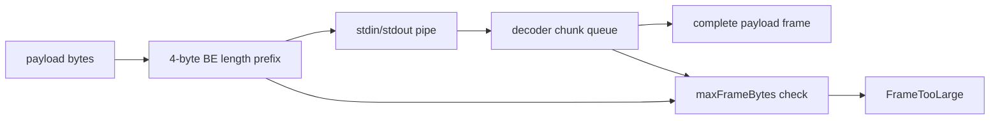

# Implement initial framed stdio transport

## What we set out to do

The goal was to replace raw stdout parsing as the future host-runtime transport with a Phase 3 byte framing primitive. Both Rust host code and the Bun runtime needed to agree on a 4-byte big-endian length prefix, reject frames larger than the 4 MiB `maxFrameBytes` limit before allocation or write, and keep envelope decoding and method dispatch above the byte layer.

## What actually ended up working

The final implementation keeps the byte contract intentionally small. `crates/host::transport::framed` owns `FrameReader`, `FrameWriter`, and typed frame errors over generic `Read` and `Write` handles. `packages/core/src/runtime/transport.ts` mirrors the same prefix, limit, and truncation behavior with `encodeFrame`, `FrameDecoder`, and `createFramedTransport`. The shape stayed below `Supervisor` because #59 owns wiring the transport into lifecycle management. The implementation changed during review from a concatenating decoder to a chunk queue with a read cursor, so fragmented frames do not repeatedly copy the buffered payload.

## What surfaced in review

One review thread was addressed, with no pushbacks or escalations. The reviewer found that the first Bun decoder appended chunks by copying the entire buffered payload on every push. That preserved correctness but violated the operational promise of the 4 MiB limit: heavily fragmented input could force quadratic copying and large transient CPU and allocation costs. The fix replaced the single mutable buffer with a chunk queue, buffered-byte count, and read cursor, then added a byte-fragmented decode test.

## First-principles postmortem

The invariant was "each byte crossing the process boundary belongs to exactly one bounded frame." That invariant has two parts: the parser must know where the frame ends, and the implementation must not let legal fragmentation turn a bounded frame into unbounded work. The first draft protected memory allocation but not copy complexity. The corrected version treats `maxFrameBytes` as a resource boundary for both allocation and per-byte work, while leaving protocol semantics and lifecycle ownership to later Phase 3 issues.

## Game-theory postmortem

The local incentive in an early transport primitive is to optimize for small tests: concatenate incoming chunks, prove the happy-path frame splits, and move on. That creates a bad repeated game because a later caller can comply with the byte protocol but fragment a max-size frame enough to stall IPC. The review comment changed the incentive by making copy complexity a reviewable invariant, and the cross-platform CI run exposed a second mechanism lesson: child stdio smoke tests should use deterministic fd-level reads and writes when the parent owns EOF.

## Non-obvious lesson

A frame size limit is not only a memory limit. It is also a promise about the amount of work the decoder can be forced to do for one frame. If fragmented input makes the decoder recopy the accumulated body on every pipe chunk, the protocol still looks bounded on paper while behaving unbounded under load.

## Reproducible pattern (if any)

For every byte transport, test concatenated frames, partial prefixes, partial bodies, oversized prefixes, and real child stdio.
Review buffer growth as part of the transport contract, not as an optimization pass.
When the parent controls stdin EOF in a smoke test, use deterministic fd-level reads and writes in the child.

## AGENTS.md amendment candidate (if any)

Transport framing work should review copy complexity against `maxFrameBytes` and use deterministic fd-level child stdio smoke tests when the parent owns EOF. Why: size limits do not protect CI or users if fragmented input causes quadratic copying or platform-specific stream hangs.

This is a proposal. Review and edit AGENTS.md yourself if you want to adopt it - `/learn` never auto-edits AGENTS.md.
