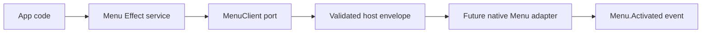

# Menu service contract

## What we set out to do

Issue #17 asked for a typed Menu service with application-menu, window-menu, clear,
bind-command, and activation-event contracts. The important invariant was that app
authors define one declarative menu tree and the bridge validates that tree before
host transport.

## What actually ended up working

The shipped slice follows the adjacent App and WebView pattern: `packages/native`
owns a `Menu` Effect service, a substitutable `MenuClient` port, concrete bridge
schemas, and an unsupported host client that returns typed `Unsupported` failures
until the native adapter lands. The useful adjustment was making recursive menu
entries plain struct schemas instead of `Schema.Class` instances, because menu
templates are JSON-shaped declarations and should not require callers to construct
nested classes.

## What surfaced in review

No review threads were opened. The local code-review pass checked correctness,
Effect error-channel discipline, schema boundaries, least privilege, and coverage.
The main design pressure came from implementation feedback: nested `Schema.Class`
values were too strict for a declarative menu tree, so the entry schemas moved to
plain structs while protocol inputs stayed as named classes.

## First-principles postmortem

The invariant was not "there is a Menu class"; it was "one serializable menu
description crosses the bridge only after validation." Once stated that way, the
class-instance failure was obvious: requiring constructors for nested items made
the API less serializable and rewarded callers for learning implementation
details. The correct boundary is a named protocol input around plain data.

## Game-theory postmortem

Future implementers are tempted to make the host adapter accept whatever payload
is convenient for a platform menu API. The schema now changes the payoff: the
cheap move is to preserve the serializable contract and let malformed templates
fail before transport. The bad equilibrium avoided is per-platform menu shapes
leaking upward into app code before `CommandRegistry` exists.

## Non-obvious lesson

Effect `Schema.Class` is valuable for named protocol rows, but it is the wrong
default for nested declarative data that app authors naturally write as object
literals. Recursive JSON-shaped contracts should use plain struct schemas inside
the top-level protocol input so validation protects the bridge without coupling
callers to constructors.

## Reproducible pattern (if any)

For native service contracts:

- keep protocol methods as named `Schema.Class` inputs;
- model nested declarative payloads as plain struct/tagged union schemas;
- validate in the bridge client before transport;
- return deferred host work as typed `Unsupported`, not missing methods.

## AGENTS.md amendment candidate (if any)

For recursive declarative contracts, prefer plain struct/tagged-union schemas
inside named protocol inputs. Why: app-authored JSON-like payloads should validate
without requiring nested class constructors.

This is a proposal. Review and edit AGENTS.md yourself if you want to adopt it —
`/learn` never auto-edits AGENTS.md.
