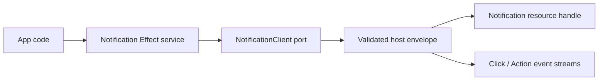

# Notification service contract

## What we set out to do

Issue #23 asked for a typed Notification service with permission/status methods,
notification posting and closing, and click/action event streams. The important
invariant was that notification delivery is permission-aware and action callbacks
remain targetable to the originating window.

## What actually ended up working

The implementation adds concrete notification schemas under
`packages/native/src/contracts/notification.ts` and the Effect service, client
port, bridge adapter, event streams, and unsupported client in
`packages/native/src/notification.ts`. Posted notifications are modeled as
resource handles, which matches the bridge's existing resource-proxy behavior and
makes close/dispose explicit rather than an untracked string id.

## What surfaced in review

No review threads were opened. The local review focused on resource semantics,
permission/status return values, and Effect error-channel discipline. A test
adapter needed explicit resource disposal support because `Notification.show`
returns a resource handle; that was the useful feedback loop.

## First-principles postmortem

A posted notification is a long-lived host object, not just a message. Treating it
as a resource handle makes its lifecycle visible to callers and tests. The
service can then model `close` as a handle operation and leave OS-specific
permission behavior behind typed status calls and host errors.

## Game-theory postmortem

If notifications were modeled as plain ids, future host adapters would be tempted
to leak lifecycle bookkeeping into per-platform code and tests would miss disposal
gaps. Returning a resource handle changes the incentive: lifecycle ownership is
part of the contract and fake exchanges must support the same disposal path as
real host resources.

## Non-obvious lesson

Any native primitive that creates a host object with a later close method should
be treated as a resource contract from the first slice. Resource proxies expose
test-adapter gaps early, which is better than discovering lifecycle drift in the
native adapter.

## Reproducible pattern (if any)

For long-lived native objects:

- use `Api.Resource` outputs rather than string ids;
- keep close methods handle-based;
- make tests provide resource disposal support;
- assert events carry the same handle shape used by close.

## AGENTS.md amendment candidate (if any)

When a native service has a later `close` or `destroy` method, model creation as
an `Api.Resource` from the contract slice. Why: lifecycle ownership should be
visible before the native adapter exists.

This is a proposal. Review and edit AGENTS.md yourself if you want to adopt it —
`/learn` never auto-edits AGENTS.md.
