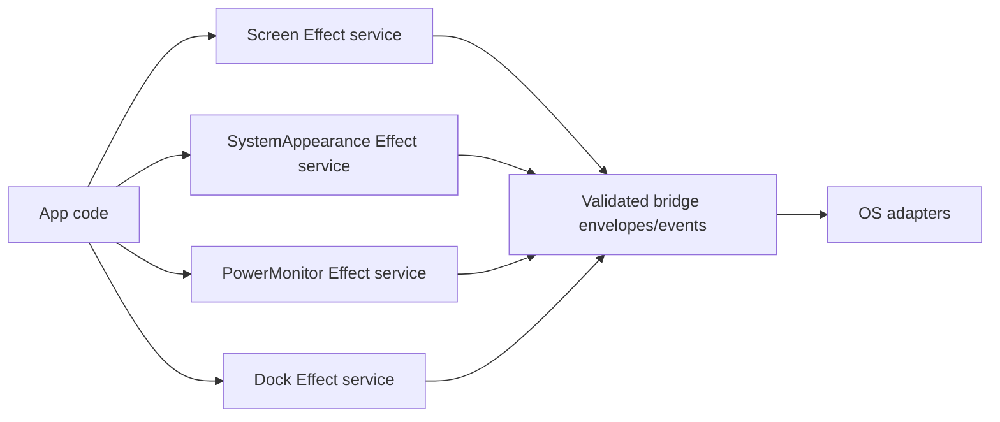

# OS state native service contracts

## What we set out to do

Issue #51 asked for Screen, SystemAppearance, PowerMonitor, and Dock service
contracts. The invariant was that OS state appears as typed reads or event
streams, while platform divergence is explicit: either a specified value like
`accentColor: null`, an `isSupported` result, or a typed `Unsupported` failure.

## What actually ended up working

The implementation adds four schema files under `packages/native/src/contracts/`
and four sibling Effect services under `packages/native/src/`. `Screen` exposes
display geometry and pointer queries. `SystemAppearance` unwraps result structs
into public values and preserves `null` as the canonical no-accent value.
`PowerMonitor` is event-only. `Dock` exposes commands plus `isSupported(method)`
so callers can inspect fine-grained platform capability.

## What surfaced in review

No review threads were opened. The local review focused on avoiding a generic
OS-state abstraction. The useful distinction was that the services share an
implementation pattern but not a domain model: display geometry, appearance
values, power lifecycle events, and dock commands have different platform
semantics.

## First-principles postmortem

Read-only does not mean uniform. The primitive concepts are value query, event
stream, command, and capability check. Modeling those directly lets each service
stay narrow while still reusing the same bridge and Effect service mechanics.

## Game-theory postmortem

A broad `OSState` module would reward future contributors for adding one more
miscellaneous platform fact to a shared bucket. Sibling services keep the cheap
move aligned with the spec sections, which makes platform differences visible in
review and prevents silent defaults from becoming the path of least resistance.

## Non-obvious lesson

Platform absence has more than one correct shape. `SystemAppearance` can return
`null` for a missing accent color because the spec defines that as data. Dock
methods should fail with `Unsupported` or expose `isSupported` because the
operation itself may not exist. Power event streams should fail when unsupported,
not quietly complete or stay empty.

## Reproducible pattern (if any)

For grouped read-only native services:

- keep one service per domain concept;
- reuse bridge mechanics, not a generic domain abstraction;
- model specified absence as data;
- model unavailable operations as typed `Unsupported`;
- test both public value unwrapping and bridge event decoding.

## AGENTS.md amendment candidate (if any)

When a grouped issue contains several OS surfaces, share only the mechanical
service pattern unless the services share the same domain invariant. Why:
mechanical similarity is not a reason to merge platform semantics.

This is a proposal. Review and edit AGENTS.md yourself if you want to adopt it —
`/learn` never auto-edits AGENTS.md.
