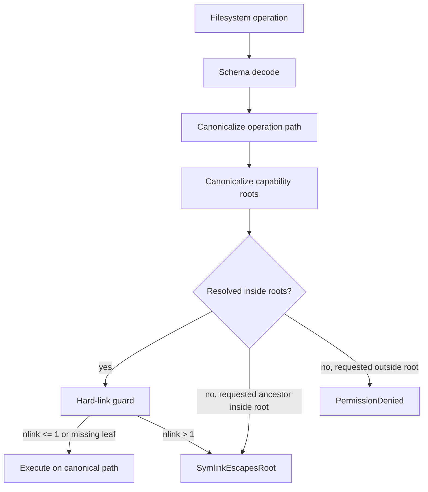

# Path normalization + symlink policy (refuse symlink traversal outside allow-list)

## What we set out to do

Issue #101 asked the filesystem service to reject symlink and hard-link escapes as typed `SymlinkEscapesRoot` failures instead of treating them as ordinary permission denials or following them silently. The key invariant was that a path requested under an allowed root must not let an app operate on a file whose resolved identity is outside that root.

## What actually ended up working

The shipped design keeps path policy inside the filesystem service. Each operation validates input with Effect Schema, resolves the operation path and capability roots through the adapter, returns `SymlinkEscapesRoot` when the requested path is under an allowed root but resolves outside it, and executes on the authorized canonical path. `Filesystem.realpath(path, capability?)` was added as a permission-checked public helper. Hard-linked regular files are denied conservatively when `nlink > 1` because the current in-process adapter can detect the link count but cannot enumerate every directory entry sharing the inode.

## What surfaced in review

One review finding changed the code. The first implementation classified leaf symlink escapes correctly, but it checked the original requested path by resolving `dirname(path)`. That missed intermediate symlink hops such as `/allowed/linkdir/file` where `linkdir` points outside the root. The fix walks lexical ancestors until it finds an ancestor whose real path is inside a capability root, so intermediate symlink escapes return `SymlinkEscapesRoot` too. The review thread was resolved after the regression test and fix landed.

## First-principles postmortem

The primitive distinction is requested authority versus resolved identity. Requested authority answers "did the caller ask for something under a granted root?" Resolved identity answers "what filesystem object would the operation touch?" A symlink escape exists only when those two facts diverge. Treating both as one canonicalized path destroys the evidence needed to choose between `PermissionDenied` and `SymlinkEscapesRoot`.

## Game-theory postmortem

The local shortcut was to use `realpath(dirname(path))` as a cheap proxy for the requested path. That made the code smaller but rewarded a false sense of coverage: leaf symlinks passed tests while intermediate symlinks were underclassified. The better mechanism is a regression test that models the attacker-controlled path shape and a helper whose name says it checks requested ancestor containment, not resolved target containment.

## Non-obvious lesson

Path policy needs two views of the same string. One view follows links to find the object being protected; the other preserves enough lexical ancestry to know whether the caller appeared to be operating inside a granted root.

## Reproducible pattern (if any)

For path escape checks:

1. Resolve the target identity for the operation.
2. Resolve capability roots.
3. Separately ask whether any requested lexical ancestor belongs to those roots.
4. Return an escape error only when requested authority and resolved identity disagree.

## AGENTS.md amendment candidate (if any)

When classifying filesystem escapes, keep requested-path containment separate from resolved-target containment. Why: resolving the whole requested path can erase the symlink hop needed to produce the correct typed error.

This is a proposal. Review and edit AGENTS.md yourself if you want to adopt it -- `/learn` never auto-edits AGENTS.md.
