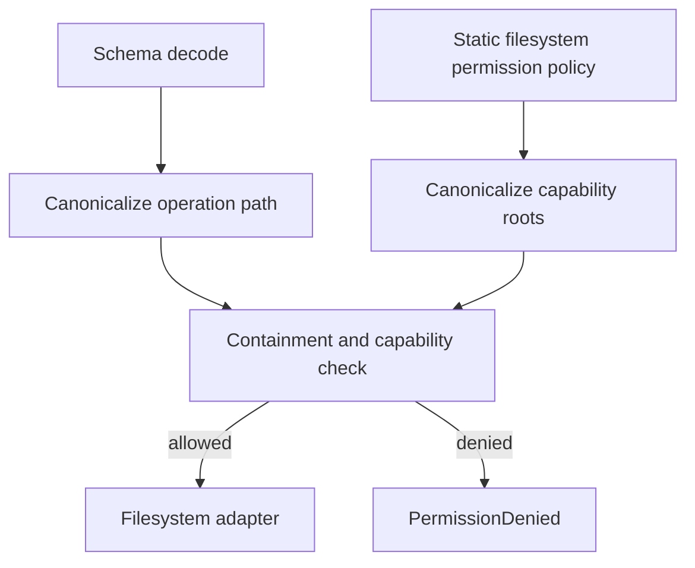

# Permission gating: every dangerous op requires capability

## What we set out to do

Issue #99 asked the filesystem service to fail closed: reads, writes, recursive deletes, and other dangerous filesystem operations should require a matching configured capability root. It also required canonical path resolution before the capability decision so symlink-shaped inputs cannot pass policy checks using a misleading requested path.

## What actually ended up working

The shipped design adds a static `FilesystemPermissionPolicy` to `makeFilesystem` options instead of inventing the Phase 16 dynamic permission broker early. The filesystem service now canonicalizes requested paths and configured roots through the adapter, checks containment, and returns typed `PermissionDenied` values before disk operations execute. Recursive remove requires both containment under `deleteRoots` and `allowRecursiveRemove: true`. The implementation keeps the permission gate inside the filesystem module so later operations have one local mechanism to reuse.

## What surfaced in review

Two review findings changed the final code. Recursive `mkdir` originally authorized only one missing trailing path segment, which rejected valid nested creation under an allowed root before the adapter could create missing directories. Delete authorization also originally used the symlink target, even though non-recursive remove deletes the directory entry itself; that could permit deletion of an out-of-root symlink pointing into an allowed root. Both were fixed with regression tests.

## First-principles postmortem

The invariant is not "call realpath everywhere." The invariant is "authorize the filesystem object that the operation will affect." Reads and watches affect the canonical target. Creating a missing path affects the deepest existing ancestor plus the requested tail. Removing a symlink affects the directory entry, not the target. The permission primitive has to encode those distinctions or it becomes a security check that proves the wrong thing.

## Game-theory postmortem

The local shortcut was to treat canonicalization as a single helper mode because it made the implementation smaller and matched the issue prose superficially. That rewards code that looks secure while leaving operation semantics mismatched. Review changed the payoff by forcing tests around the adversarial cases: nested missing paths and symlink delete authority. The durable mechanism is to make each operation choose an explicit canonicalization mode, so reviewers can see what object is being authorized.

## Non-obvious lesson

Path permission checks need operation semantics, not only string containment. A "canonical path" can mean target identity, parent-plus-new-entry, or directory-entry identity depending on whether the operation reads, creates, or unlinks.

## Reproducible pattern (if any)

For filesystem authorization:

1. Name the object the operation will affect.
2. Canonicalize that object, not just the raw argument.
3. Check capability roots against that canonical object.
4. Add one symlink or missing-path regression test for each new operation class.

## AGENTS.md amendment candidate (if any)

When adding filesystem permission gates, require each operation to state whether it authorizes target identity, parent-plus-new-entry, or directory-entry identity. Why: one-size `realpath(path)` checks can authorize the wrong object.

This is a proposal. Review and edit AGENTS.md yourself if you want to adopt it — `/learn` never auto-edits AGENTS.md.
