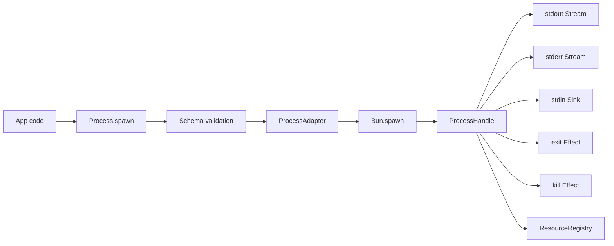

# Process service: spawn, stdin/stdout/stderr streams, exit code, kill

## What we set out to do

Issue #107 asked for the Phase 12 process operation surface: a scoped Effect service that wraps child process spawn, typed stdin/stdout/stderr streams, typed exit status, and typed kill. The core invariant was that app code should not reach for `Bun.spawn` directly, because direct use loses error mapping, resource ownership, and future policy attachment points.

## What actually ended up working

The shipped shape is a `Process` runtime service in `packages/core/src/runtime/process.ts`. `Process.spawn` validates command, args, owner scope, cwd, env, and kill signal through Effect Schema before touching Bun, registers a `process` resource, converts Bun stdout/stderr `ReadableStream`s to Effect streams, exposes stdin as an Effect `Sink`, and maps spawn/lifecycle failures into host protocol errors. A local `ProcessAdapter` hides Bun's process API so tests can exercise lifecycle and error paths without relying on OS timing.

## What surfaced in review

One local review finding changed the boundary: omitted `args` or `options` from a JavaScript caller would have produced a defect instead of a typed validation failure. The API now accepts missing boundary values and lets Schema return `InvalidArgument`. A PR review thread also found that resources stayed registered if a child exited naturally and the caller never awaited `handle.exit`; that is now fixed by an Effect observer that disposes the registry handle when the child exits. A second thread asked for SIGTERM timeout escalation; that was intentionally pushed back because force-kill and process-tree cleanup belong to sibling issue #109.

## First-principles postmortem

The invariant was not only "spawn returns a handle"; it was "the framework owns process lifecycle truth." A child process has two independent observers: the app can await `exit`, and the OS can terminate the child without the app awaiting anything. Registry state must follow the OS event, not the caller's chosen consumption path. The key correction was moving resource disposal onto the child-exit event while keeping `handle.exit` as a typed value surface for callers.

## Game-theory postmortem

The local shortcut is to make process cleanup a caller responsibility because it keeps the first implementation smaller. That creates a bad equilibrium: app authors who only consume stdout appear to use the service correctly while leak accounting drifts. The mechanism that aligned incentives was a scoped service with a narrow handle plus an internal exit observer; app authors get the easy stream/exit API, and maintainers keep one place to attach later argv policy, budgets, and stronger cleanup.

## Non-obvious lesson

Effect-owned code can still leak defects at the JavaScript boundary if TypeScript-required parameters are dereferenced before Schema validation. Public service methods should treat optional or malformed JS inputs as data and let Schema produce typed failures, even when the TypeScript interface documents the happy path.

## Reproducible pattern (if any)

For runtime resources backed by external lifecycle events:

1. validate every public boundary value with Schema before adapter calls;
2. register the resource immediately after acquisition;
3. attach an Effect observer to the external terminal event;
4. make user-facing completion effects observe the same terminal value, not own cleanup exclusively.

## AGENTS.md amendment candidate (if any)

When adding a scoped resource service, test the resource disappearing on its external terminal event even when the caller never awaits the public completion Effect. Why: lifecycle ownership must not depend on the caller choosing the cleanup-shaped API path.

This is a proposal. Review and edit AGENTS.md yourself if you want to adopt it — `/learn` never auto-edits AGENTS.md.
