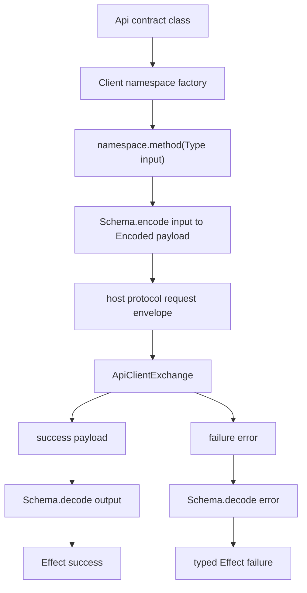

# Renderer client codegen: generate Desktop.Client typed surface from the contract registry

## What we set out to do

The goal was to give renderer code a typed `Desktop.Client` surface derived from API contracts, so application authors call `Desktop.Client.x.method(input)` instead of hand-writing raw invoke wrappers. The invariant was that method input, output, and typed error all come from the contract schema, and that host protocol concerns stay behind a narrow client interface.

## What actually ended up working

An in-process client factory in `@effect-desktop/bridge` was the right first slice. `Client({ namespace: Contract }, exchange, options)` builds frozen namespaces, mints request metadata, encodes typed inputs to wire payloads, sends a request envelope through a mockable exchange, decodes success payloads, and decodes failure payloads through the contract error schema before failing the Effect. `@effect-desktop/core` re-exports the factory as `Desktop.Client`.

## What surfaced in review

Three review findings changed the final design. The client originally advertised typed contract errors but never decoded `spec.error`; the fix made the exchange response an explicit success/failure union. Void-input methods originally forced callers to pass `undefined`; the fix made `undefined` input schemas callable with zero arguments and omitted the request payload. The last finding caught a deeper boundary bug: input schemas must be encoded from `Type` to `Encoded` before crossing the host boundary, not decoded as if the typed caller value were unknown external data.

## First-principles postmortem

The invariant is directionality at the boundary. Renderer input starts as trusted typed domain data and must be encoded before transport. Host output and host error payloads start as untrusted wire data and must be decoded before entering renderer code. Treating both directions as "validation" hides the difference and silently breaks transformed schemas such as `NumberFromString`.

## Game-theory postmortem

The local incentive was to get a typed-looking API green quickly by making every method return `Effect<Output, Error | HostProtocolError, never>`. That type can be honest only if the runtime path decodes the exact same schema positions. Review forced the implementation to pay down that hidden debt immediately: explicit success/failure responses made typed errors observable, zero-arg methods made no-input contracts ergonomic, and an encoded-input regression test made transformed schemas part of the contract.

## Non-obvious lesson

Effect Schema contracts are bidirectional, not just runtime validators. A client generator must preserve the schema's direction: `encodeEffect(input)` for outbound typed values, `decodeUnknownEffect(output)` for inbound payloads, and `decodeUnknownEffect(error)` for inbound typed failures. If the code only says "decode payload," it is probably erasing the boundary direction.

## Reproducible pattern (if any)

At every bridge boundary, name the value by direction:

- outbound typed value -> encoded payload;
- inbound success payload -> decoded output;
- inbound failure payload -> decoded contract error.

Then test at least one schema where `Type` differs from `Encoded`.

## AGENTS.md amendment candidate (if any)

When implementing schema-backed bridge code, include at least one transformed-schema test where `Type` differs from `Encoded`. Why: same-type schemas cannot catch decode/encode direction mistakes.

This is a proposal. Review and edit AGENTS.md yourself if you want to adopt it — `/learn` never auto-edits AGENTS.md.
