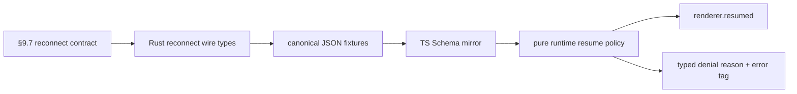

# Renderer reconnect foundation

## What we set out to do

Issue #62 set out to make transient renderer disconnects distinguishable from fresh launches. The full §9.7 behavior includes token-bound resume, a 30 second reconnect window, stream cursor backfill capped at 1024 events, and typed denial when resume cannot be trusted.

## What actually ended up working

The final PR intentionally implements the phase-3 foundation rather than the entire later renderer/runtime experience. `crates/host-protocol` owns the reconnect constants and strict wire payloads for `ResumeTicket`, `renderer.disconnected`, `renderer.resume`, `renderer.resumed`, and `renderer.resume.denied`. `packages/bridge` mirrors those shapes with Effect Schema and shared fixtures. `packages/core/src/runtime/reconnect.ts` adds the pure resume decision policy for expiry, window mismatch, origin hash mismatch, nonce mismatch, cursor mismatch, and backfill exhaustion.

## What surfaced in review

The local `/code-review` pass and GitHub Codex both found the same major issue: the first resume policy trusted `resume.cursors` as the replay authority and only checked whether backfill was available for those stream ids. That allowed a valid ticket to request a stream id or cursor value not present in the ticket snapshot. The fix requires every requested cursor to match `ticket.lastStreamCursors[streamId]` before backfill is considered, and adds regression tests for tampered cursor values and untracked stream ids.

## First-principles postmortem

The invariant is authority continuity. A reconnect is safe only if the identity and cursor state being resumed are owned by the host/runtime ticket, not by renderer-provided input. The initial design correctly treated `windowId`, `originTokenHash`, and `resumeNonce` as ticket-bound facts, but missed that stream cursors are authority-bearing too. Once cursor values influence replay, they are not just client progress hints; they are part of the security and consistency boundary.

## Game-theory postmortem

The local incentive was to make the pure policy minimal by checking only ticket identity and backfill capacity. That is attractive because real stream buffers do not exist yet. The bad repeated game is that future stream replay code would inherit `resume.cursors` as already-validated truth and build replay behavior on untrusted renderer state. Review changed the payoff by naming the ticket snapshot as the source of truth, making later replay code cheaper and safer.

## Non-obvious lesson

Resume cursors are not passive offsets. In a reconnect protocol, cursor values decide what history may be replayed, so they carry authority. A valid token and nonce prove the client can attempt resume; the ticket snapshot proves which streams and cursor positions are allowed to resume.

## Reproducible pattern (if any)

For reconnect and replay protocols, validate identity and replay position against the same authority object.
Treat cursor maps as privileged state when they can request historical data.
Add tampering tests before the real replay adapter exists, so later code cannot inherit a permissive policy.

## AGENTS.md amendment candidate (if any)

For reconnect, replay, or backfill features, cursor values must be validated against the owner-side snapshot before replay. Why: cursors select historical data and therefore carry authority, not just progress metadata.

This is a proposal. Review and edit AGENTS.md yourself if you want to adopt it — `/learn` never auto-edits AGENTS.md.
