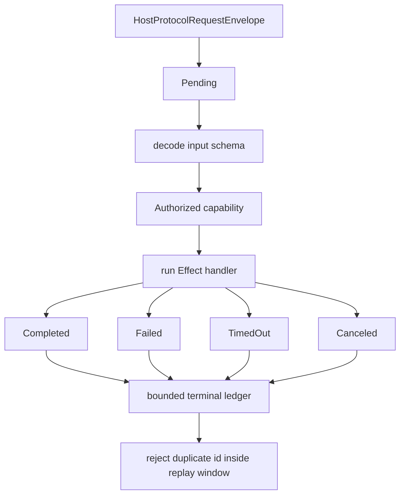

# Request/response lifecycle: serialize, send, receive, decode, fulfill Effect

## What we set out to do

Issue #114 set out to make bridge calls traverse an explicit lifecycle with one terminal state: decode before authorization, authorization before handler execution, and terminal states visible to observability. The important invariant was that a late or duplicate frame must not turn a timed-out or failed call back into success.

## What actually ended up working

The lifecycle owner landed inside the existing contract-bound handler runtime rather than as a separate wrapper. That mattered because `Handlers.dispatch` already owns method lookup, schema direction, and typed contract error encoding. `Handlers.withOptions(...)` now lets tests and later transport code inject a clock and lifecycle observer while keeping the original `Handlers(...layers)` call shape. The runtime emits `Pending`, `Authorized`, `Running`, and exactly one terminal state, rejects duplicate ids inside a bounded replay window, enforces method timeouts through `Effect.timeout`, and keeps malformed input/output as typed `HostProtocolError` failures.

## What surfaced in review

Two review threads were addressed and resolved. The first found that the terminal-state ledger retained every request id forever; the fix records terminal states with timestamps and purges them after a configurable replay window. The second found that matching Effect timeout failures by `_tag: "TimeoutError"` could misclassify a domain error with the same tag; the fix uses Effect's branded `Cause.isTimeoutError` guard and adds a regression test proving domain failures still encode through the contract error path. No comments were pushed back or escalated.

## First-principles postmortem

The invariant was not only "emit lifecycle events." The stronger invariant is "the lifecycle classifier is the authority for request state, and it must not create a second failure channel." That made the handler runtime the correct owner because it can observe schema decode, authorization stub, handler execution, output encoding, timeout, cancellation, and terminal duplication in one Effect path. A separate wrapper would make `Authorized` or `Running` claims before the code path had actually crossed the schema and contract boundary.

## Game-theory postmortem

The local incentive was to add observability by accumulating state and to classify timeouts with the easiest visible field. Both moves make the first implementation cheap and the long-running system expensive: request ids become hidden memory growth, and user-shaped errors can be stolen by infrastructure classification. Review aligned the code by forcing each mechanism to carry its own proof: bounded replay state for duplicate rejection, and branded Effect timeout detection for infrastructure timeouts.

## Non-obvious lesson

Lifecycle state is operational state, not just telemetry. If a module records terminal ids to reject late frames, that record needs a retention policy at creation time. If a module maps Effect infrastructure errors into protocol errors, the classifier must use the primitive's brand or constructor, not a user-controlled string field.

## Reproducible pattern (if any)

Put lifecycle observation inside the module that owns the actual boundary transition.
Give every replay or duplicate-protection ledger an explicit retention window.
Classify Effect infrastructure failures with Effect predicates, not structural fields that user errors can copy.
Test domain errors that intentionally collide with infrastructure-looking tags.

## AGENTS.md amendment candidate (if any)

When adding lifecycle ledgers or duplicate-frame protection, include a bounded retention policy and a regression test for expiry; Why: unique request ids otherwise turn correctness bookkeeping into hidden memory growth.

This is a proposal. Review and edit AGENTS.md yourself if you want to adopt it — `/learn` never auto-edits AGENTS.md.
