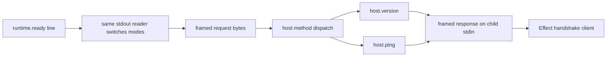

# Required host handshake methods

## What we set out to do

The goal was to prove that the framed host-runtime pipe can carry real request/response traffic before larger native methods arrive. The required surface was `host.version`, which returns the shared protocol semver, and `host.ping`, which returns a no-op response with the same request id. The runtime also needed an Effect-shaped client wrapper so version negotiation and liveness checks use the same envelope as later methods.

## What actually ended up working

The final implementation keeps the startup boundary explicit: stdout is line-oriented only until the `runtime.ready` line, then the same buffered reader switches to framed protocol messages. That detail matters because `BufReader::read_line` can already hold bytes after the newline; reusing the reader preserves any frame bytes that arrive in the same pipe burst. `crates/host::methods` owns dispatch and handshake payloads, `crates/host-protocol` owns method names plus `HostVersionPayload`, `packages/bridge` owns the Effect handshake client, and `packages/core` owns the Bun stdio exchange adapter used by the runtime entry.

## What surfaced in review

No review findings were posted. The local and CI verification did surface one non-obvious lifecycle detail: the Bun runtime entry remained alive after receiving both responses because the stdin stream reader kept the event loop open. The phase still treats `packages/core/src/runtime/main.ts` as a smoke binary, so it exits explicitly after the handshake succeeds; later runtime-service issues should replace that with a real long-lived loop and transport cleanup primitive.

## First-principles postmortem

The invariant was "peers agree on protocol version before any other method runs." The implementation is correct only if the version check uses the real frame path, not a direct function call or a second ad hoc channel. The stdout mode switch is the key primitive: ready remains human-debuggable and line-based, but every byte after readiness belongs to the length-prefixed protocol. That lets the host prove version and ping through the same envelope, dispatch table, serializer, and pipe handles that later methods will use.

## Game-theory postmortem

The local incentive was to keep readiness and handshake as separate easy mechanisms: print a line for readiness, then test handlers directly. That would let future code believe the pipe works while never exercising request ids, trace ids, framing, response writes, or runtime decode. The mechanism that improved alignment was an end-to-end child-process test where the runtime writes framed requests after readiness and refuses to pass unless the host returns matching framed responses.

## Non-obvious lesson

A startup protocol can transition from line-oriented debug output to binary frames, but only if one owner controls the stream across the transition. Splitting the ready reader and frame reader would risk losing bytes buffered after the newline; reusing the same buffered reader makes the mode switch explicit and testable.

## Reproducible pattern (if any)

When a protocol phase adds the first real method, exercise it through the production transport.
Keep startup mode transitions owned by one stream reader.
Use direct handler tests for table behavior, then child-process tests for pipe behavior.
If a smoke binary opens a stream reader, decide whether it should close the reader or exit explicitly.

## AGENTS.md amendment candidate (if any)

Protocol startup work should test the exact mode transition between readiness signaling and framed transport. Why: direct handler tests cannot catch lost buffered bytes or stream readers that keep a smoke runtime alive.

This is a proposal. Review and edit AGENTS.md yourself if you want to adopt it - `/learn` never auto-edits AGENTS.md.
