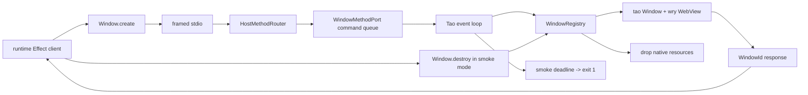

# Required host methods Window.create and Window.destroy

## What we set out to do

Issue #60 set out to prove that a runtime Effect can drive real native state only through the typed framed host protocol. The required surface was the first native-touching method group: `Window.create`, which opens a Tao window and WRY WebView and returns a `WindowId`, and `Window.destroy`, which drops the host-owned native resources for that id. The runtime was supposed to hold only the id; the host remained the owner of native lifetime.

## What actually ended up working

The final implementation keeps the architecture's ownership line intact. `crates/host-protocol` owns the canonical `Window.create` and `Window.destroy` method names plus the Rust payload and response types. `packages/bridge/src/window.ts` mirrors those shapes as Effect v4 client wrappers with strict Schema parsing. `packages/core/src/runtime/main.ts` calls `host.version`, `host.ping`, `Window.create`, and, in smoke mode, `Window.destroy` for the returned id.

The host side shifted while preserving the main invariant. The first draft routed commands through a Tao event-loop proxy, then through pre-loop startup drains, but Linux under `xvfb` exposed that native window and WebView creation must stay on the normal Tao event-loop path and that event-loop startup can be slow. The final `WindowMethodPort` queues commands before the event loop starts, the loop drains that queue on bounded idle polls, and smoke mode has an explicit failure deadline so a missing destroy proof exits nonzero instead of hanging CI.

## What surfaced in review

Two review findings changed the final design. The external Codex review found that failed `Window.create` returned `Other`, leaving the event loop waiting with no registered window and no runtime. That was addressed by mapping create failure to `WindowCreateFailed` and `ControlFlow::ExitWithCode(1)`.

The local `/code-review` pass found that after moving smoke create/destroy fully onto the event loop, a runtime path that never reached `Window.destroy` could leave the host event loop alive forever. That was addressed with a smoke-only deadline that emits `source="window-smoke-timeout"` and exits nonzero. No pushbacks or escalations were needed.

CI surfaced the operational detail that mattered most: Ubuntu `xvfb` native startup can take just over 30 seconds before the first queued window command is handled. The method reply timeout was raised to 120 seconds so slow native backend startup is not misclassified as host unavailability.

## First-principles postmortem

The invariant was not "a window opens"; it was "native state changes are host-owned side effects caused by typed protocol calls." That means the runtime can request a window and hold a `WindowId`, but it cannot own Tao or WRY handles. The host must also process those requests on the thread that owns the native event loop.

The assumption that changed was timing. It was tempting to make smoke verification finite by draining commands before entering the event loop. That made local success easier but fought the native backend's lifecycle. The simpler stable model is: let runtime requests queue early, then process native side effects only once Tao is running, with explicit time bounds around the proof.

## Game-theory postmortem

The local incentive was to make CI green by moving work out of the event loop or by accepting an optimistic method timeout. Both moves are cheap locally and expensive later: they either hide platform lifecycle constraints or create a failure mode where CI hangs instead of teaching the next engineer what broke.

The mechanism that aligned behavior was cross-platform smoke evidence plus bounded failure. macOS proved the fast path, Ubuntu proved slow native startup, Windows proved the same smoke flow could exit cleanly, and the smoke deadline made the bad path finite. The good equilibrium is now cheaper: future native methods should queue requests at the protocol boundary, execute native work on the event-loop owner, and give CI a positive proof plus an explicit timeout proof.

## Non-obvious lesson

Native event-loop readiness is not the same as host protocol readiness. The runtime can be ready to send framed requests before Tao and WRY are ready to satisfy them, especially under Linux `xvfb`. The correct bridge is a command queue plus a bounded event-loop poll, not a synchronous shortcut around the loop. The timeout belongs to the proof as much as the success path: without a smoke deadline, "destroy never arrived" becomes a hung job rather than a failed invariant.

## Reproducible pattern (if any)

Let runtime requests queue before native loop readiness.
Execute native side effects only on the loop that owns the handles.
Set host-method timeouts from observed slow backend startup, not local fast paths.
For smoke tests, verify both success and bounded failure.

## AGENTS.md amendment candidate (if any)

Native event-loop smoke tests must include a bounded failure path in addition to a success assertion. Why: a missing native proof should produce an explicit nonzero exit, not wait for the CI job timeout.

This is a proposal. Review and edit AGENTS.md yourself if you want to adopt it - `/learn` never auto-edits AGENTS.md.
