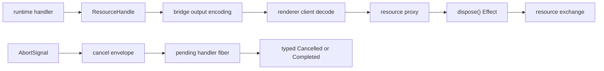

# Resource handles + cancellation propagation across the bridge

## What we set out to do

Issue #117 asked the bridge to carry runtime-owned `ResourceHandle`s into the renderer without degrading them into raw IDs, and to propagate renderer cancellation into the runtime handler lifecycle. The target invariant was that renderer-held handles keep `(kind, id, generation, ownerScope)` identity, stale operations fail as typed values, and renderer aborts interrupt cancellable runtime work.

## What actually ended up working

The bridge contract gained `Api.Resource(kind, state)` as a third output form next to schemas and streams. Handler output encoding now accepts resource handles through the resource handle schema, and client output decoding turns matching handles into frozen proxies whose `dispose()` delegates to a resource exchange. Cancellation ended up cleaner as two separate mechanisms: the client owns `AbortSignal` conversion into cancel envelopes, while the handler runtime owns the pending-call map and interrupts only the tracked handler fiber.

The original issue diagram mentioned a renderer-scope registry inside the bridge. That was deliberately kept as an exchange boundary instead: `@effect-desktop/bridge` cannot depend on `@effect-desktop/core`, so the registry remains downstream and the bridge exports the typed port.

## What surfaced in review

Three review threads were addressed and resolved. The first internal review found that already-aborted signals sent a fire-and-forget cancel before the runtime had a pending handler, then still dispatched the request. Codex independently found the same race. Codex also found that `cancellable: false` contract metadata was ignored by the cancel path, because the runtime interrupted every pending fiber unconditionally. Both findings changed the final design: pre-aborted client calls now fail with typed `Cancelled` before dispatch, and pending calls record whether the method is cancellable before honoring renderer cancel envelopes.

## First-principles postmortem

The important invariant was not "a cancel envelope exists"; it was "a canceled call cannot create or interrupt the wrong runtime work." The first implementation confused two lifecycles: client-side abort state and runtime-side pending handler state. If the signal was already aborted, there was no runtime owner yet, so sending a cancel envelope was at best meaningless and at worst misleading. The fix was to represent pre-start cancellation as a client-side typed failure, and post-start cancellation as a runtime fiber interrupt.

## Game-theory postmortem

The risky local move was easy: a caller could pass an already-aborted signal and assume no work would run. Without a preflight failure, the cost shifted to the runtime, which might start work after the caller had already opted out. The second risky move was for the runtime to treat every cancel envelope as authoritative, even when the contract explicitly said the method was non-cancellable. Recording cancellability with the pending fiber makes the good move cheaper for future maintainers: the cancel path now has the method policy in the same place as the interrupt target.

## Non-obvious lesson

Cancellation has at least two phases, and they need different owners. Before dispatch, cancellation is a client decision and should return a typed value without crossing the bridge. After dispatch, cancellation is a runtime decision and must target the specific handler fiber only if the contract allows it.

## Reproducible pattern (if any)

When wiring cancellation across a bridge:

1. Check pre-start cancellation before sending the request.
2. Register the exact runtime fiber that owns the work.
3. Store method cancellation policy beside the fiber.
4. Convert every terminal path into a typed value.

## AGENTS.md amendment candidate (if any)

For bridge cancellation work, require tests for both already-aborted signals and `cancellable: false` methods. Why: both are lifecycle boundary cases that happy-path abort tests do not cover.

This is a proposal. Review and edit AGENTS.md yourself if you want to adopt it — `/learn` never auto-edits AGENTS.md.
