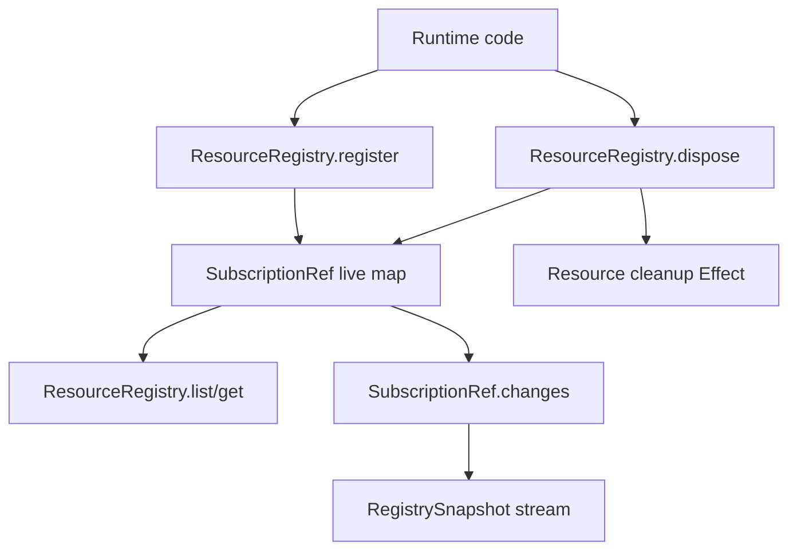

# ResourceRegistry Effect service: register / get / list / dispose

## What we set out to do

Issue #80 asked for the core resource registry foundation: one Effect-owned place to register framework resources, retrieve live entries, list snapshots, dispose handles idempotently, and observe registry changes. The planned invariant was that every framework handle should be created through the registry so devtools, tests, shutdown, and later leak detection can ask one question: what is alive?

## What actually ended up working

The shipped module keeps the live resource map inside `ResourceRegistry`, returns typed handles with UUIDv7 IDs and owner scopes, and removes entries before running cleanup so duplicate dispose calls are idempotent. The installed Effect v4 beta did not expose `Effect.Service`, so the service tag uses the pinned package's actual surface: `Context.Service` with `Layer.effect`. The important architecture change came after review: observation now uses `SubscriptionRef`, which couples current state and change notifications in one primitive instead of maintaining a separate `Ref` and `PubSub`.

## What surfaced in review

Two review threads raised the same correctness issue and both were addressed. The first implementation emitted `Stream.fromEffect(snapshot())` and only then subscribed to `Stream.fromPubSub`; a register or dispose in that gap could be missing from both the initial snapshot and subsequent updates. No comments were pushed back or escalated. The review changed the final design from a split map/pubsub implementation to a single state-and-updates primitive.

## First-principles postmortem

The invariant was not only "there is one map of live resources." The real invariant was "observers see a linearized history of that map." A separate read path and notification path broke that invariant because they created time between snapshot acquisition and subscription. Once observation was treated as part of the registry's state model rather than an add-on notification channel, the simpler design was to put state in a primitive that already owns current value plus changes.

## Game-theory postmortem

The easy local move was to pair `Ref<Map>` with `PubSub<Snapshot>` because it made register/list/dispose straightforward and passed the first tests. The hidden cost would have landed on devtools and leak detection, where a stale observer would look like a consumer bug instead of a registry bug. The review mechanism corrected the incentive by forcing the producer module to hide the race. Future reviews should check every "snapshot + subscribe" implementation for a lost-update gap before accepting it.

## Non-obvious lesson

For observable state, "current value" and "future updates" are one concept. Splitting them into a storage primitive and a notification primitive is only correct when the module also proves subscription and snapshot acquisition are linearized. In Effect v4 beta, `SubscriptionRef` is the deeper module for this shape because it makes the correct observer behavior cheaper than hand-assembling `Ref` and `PubSub`.

## Reproducible pattern (if any)

When an API promises `observe()` for live state:

1. Use a primitive that couples state with changes, or prove subscription happens before snapshot.
2. Add a test that starts observing, mutates state, and consumes both the initial and next snapshot.
3. Treat `Ref` plus `PubSub` as suspect unless the lost-update gap is closed explicitly.

## AGENTS.md amendment candidate (if any)

For observable Effect-owned state, prefer `SubscriptionRef` or an equivalent linearized state/update primitive over separate `Ref` plus `PubSub`; Why: separate current-value and future-update paths create missed-update races unless the module proves subscription ordering.

This is a proposal. Review and edit AGENTS.md yourself if you want to adopt it -- `/learn` never auto-edits AGENTS.md.
