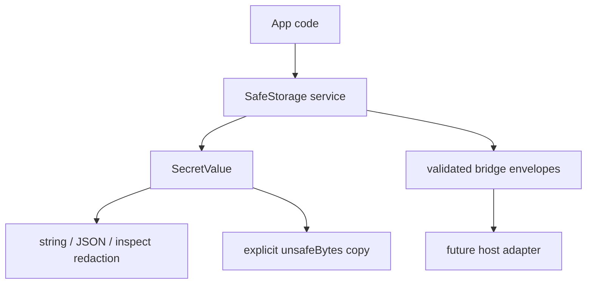

# SafeStorage service with redaction boundary

## What we set out to do

Issue #54 asked for a typed `SafeStorage` service over platform-backed secret storage, plus the §14.10 guarantee that secret values do not leak through logs, devtools, trace exporters, or plain formatting. The intended invariant was that app code receives a secret as a tagged value, not as an ordinary string or byte array that every caller can accidentally print.

## What actually ended up working

The shippable unit was the native service contract and renderer-side redaction boundary. `SafeStorage` now exposes typed `set`, `get`, `delete`, `list`, and `isAvailable` operations through an Effect service and bridge client, validates keys before transport, and returns decoded secret bytes inside `SecretValue`. `SecretValue` redacts `toString`, JSON, and Node inspect formatting, returns byte copies only through an explicit `unsafeBytes()` method, and disposes its internal buffer through an Effect primitive. The broader logger/devtools/trace integration did not land because those repo primitives do not exist yet.

## What surfaced in review

The local review found no actionable PR comments. The important review pressure was architectural rather than line-level: do not pretend a complete §14.10 logging/devtools policy exists when the repo only has enough surface to enforce redaction at the value boundary.

## First-principles postmortem

The core invariant is that secret payloads should stop being ordinary data as soon as they cross into framework-owned code. That does not require inventing a global logger or devtools subsystem during this phase. It does require a concrete value type whose default formatting is redacted, whose raw access is named as unsafe, and whose bridge failures stay typed in the Effect error channel.

## Game-theory postmortem

The dangerous local incentive is to close the issue title by adding a shallow logging or devtools placeholder that claims policy coverage without owning the real sinks. The better mechanism is to ship the first enforceable boundary now and make the remaining sinks explicit future work. That keeps future reviewers from trusting a false guarantee and makes accidental printing harder for app authors immediately.

## Non-obvious lesson

Secret redaction is only as strong as the boundary that all secret values must cross. In this repo, the first real boundary is not a logger; it is the native service return type. Putting redaction behavior on `SecretValue` gives every later sink a concrete thing to recognize, while avoiding a fake global policy before logging, devtools, and tracing have real modules.

## Reproducible pattern (if any)

For sensitive service results, separate wire payload classes from public value wrappers.
Keep raw access explicit and named as unsafe.
Implement default formatting redaction on the wrapper before adding sink-specific integrations.
Model unsupported platform adapters as typed Effect failures, with availability probes returning ordinary values.

## AGENTS.md amendment candidate (if any)

For issue slices that reference future cross-cutting sinks, ship only the enforceable boundary in the current module and record missing sinks in learning; Why: claiming repo-wide policy before the sink exists creates false production confidence.

This is a proposal. Review and edit AGENTS.md yourself if you want to adopt it — `/learn` never auto-edits AGENTS.md.
