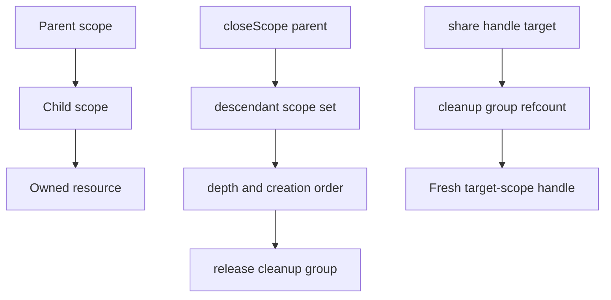

# Scope graph: parent-child ownership; cascade dispose when a parent scope closes

## What we set out to do

The goal was to give resources explicit scope ownership so closing a parent scope disposes every transitively owned resource exactly once, child scopes first, with bounded disposal time. The issue also required `Resource.share` to return a fresh handle in the target scope without changing the original handle's owner.

## What actually ended up working

The shipped shape kept the ResourceRegistry as the narrow interface and pulled the scope graph into the registry implementation. `declareScope` records parent links, `closeScope` snapshots live entries, finds descendant scopes, orders resources by scope depth and creation time, and applies `disposalGraceMs` during scope-close cleanup. `share` did not fit as a simple second registration with a no-op disposer: source scope close would have released the native cleanup while the target-scope handle still lived. The working design adds cleanup groups with a small reference count so all handles that represent the same native cleanup release it exactly once, after the final owning registry entry is closed.

## What surfaced in review

One review thread was addressed and resolved. The finding was that `scopeDepth` followed parent pointers until it found a missing parent, but `declareScope` could create a cycle such as `A -> B` and `B -> A`. That made `closeScope` capable of hanging before disposal. The fix was to make scope-depth traversal total with a visited set and add a regression test that closes a cyclic scope graph under a timeout. There were no pushed-back or escalated comments.

## First-principles postmortem

The invariant that mattered was termination plus exactly-once cleanup. A shutdown path must make progress under bad registry state because shutdown is where recovery depends on cleanup completing. The assumption that changed was that `share` is not just another handle; it changes cleanup ownership. Once more than one handle can refer to the same native release action, the cleanup identity becomes separate from the registry entry identity.

## Game-theory postmortem

The local incentive was to implement the visible API surface only: parent lookup, sort, dispose, and return a copied handle for sharing. That would satisfy the happy-path story while hiding two later costs: source scope close could invalidate a shared target handle, and malformed scope declarations could block disposal entirely. The mechanism that improved alignment was adding tests at the lifecycle boundary instead of only the API boundary: source-close before target-close, disposer timeout, and cyclic scope topology. Those tests make the cheapest implementation the correct one.

## Non-obvious lesson

Lifecycle graph code must be total over malformed topology, even when the model intends a tree. Scope ownership is infrastructure code; if it hangs during close, every caller inherits the failure. Sharing a resource also splits entry ownership from cleanup ownership, so cleanup needs its own identity and reference count instead of living directly on each entry.

## Reproducible pattern (if any)

When a lifecycle API introduces graph traversal, test the malformed graph shape that would make traversal non-terminating.
When an API duplicates a handle without duplicating the underlying native resource, move cleanup identity out of the entry and make release explicit.
Test close paths in the order users will actually hit them: source close, target still live, final target close.

## AGENTS.md amendment candidate (if any)

When adding graph traversal for lifecycle code, test cycles or malformed topology even if the intended graph is acyclic. Why: shutdown paths must terminate under bad state.

This is a proposal. Review and edit AGENTS.md yourself if you want to adopt it -- `/learn` never auto-edits AGENTS.md.
