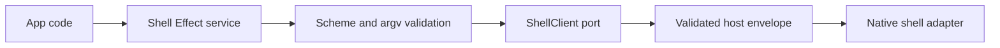

# Shell service contract

## What we set out to do

Issue #50 asked for a Shell service that opens external URLs and local paths
without letting callers smuggle unsafe shell behavior through convenience APIs.
The invariant was that URL allowlists, executable path gating, and argv
metacharacter checks happen before any host envelope is sent.

## What actually ended up working

The implementation adds Shell schemas under `packages/native/src/contracts/shell.ts`
and the Effect service, client port, bridge adapter, and unsupported adapter in
`packages/native/src/shell.ts`. The bridge client validates inputs as Effect
values: `file:` URLs and non-allowlisted schemes return `PermissionDenied`,
executable paths require explicit `allowExecutable: true`, and shell
metacharacters in path-like inputs return `InvalidArgument` before transport.

## What surfaced in review

No review threads were opened. The useful local review finding was that a naive
URL local-path check would reject ordinary `https://host/path` URLs because URL
pathnames normally begin with `/`. The check was narrowed to the hard invariant:
`file:` is denied, scheme allowlisting is enforced, and path execution checks are
handled by path-specific Shell methods.

## First-principles postmortem

Shell is a security boundary, not just a native convenience wrapper. The host
still owns platform execution, but the TypeScript bridge owns the first
permission shape that app code sees. Making that validation pre-transport gives
tests a precise way to prove denied inputs never reach the host.

## Game-theory postmortem

If validation lived only in documentation or a later host adapter, callers would
optimize for "make the OS open this thing" and unsafe strings would spread across
app code. The typed service changes the incentive: the easiest API is also the
auditable API, and failed policy checks are observable Effect values rather than
exceptions or host side effects.

## Non-obvious lesson

URL parsing and path policy are separate checks. A URL pathname is not evidence
of a local file, because valid web URLs have pathnames too. Deny `file:` and
non-allowlisted schemes at the URL layer; reserve executable and metacharacter
policy for path inputs.

## Reproducible pattern (if any)

For security-sensitive native services:

- validate before bridge transport;
- assert denied inputs leave the host request list empty;
- return policy failures through the Effect error channel;
- keep URL allowlisting separate from filesystem path policy.

## AGENTS.md amendment candidate (if any)

For Shell-like services, tests must assert both the typed denial and zero host
requests for denied inputs. Why: pre-transport validation is the security
mechanism, not merely an error shape.

This is a proposal. Review and edit AGENTS.md yourself if you want to adopt it —
`/learn` never auto-edits AGENTS.md.
