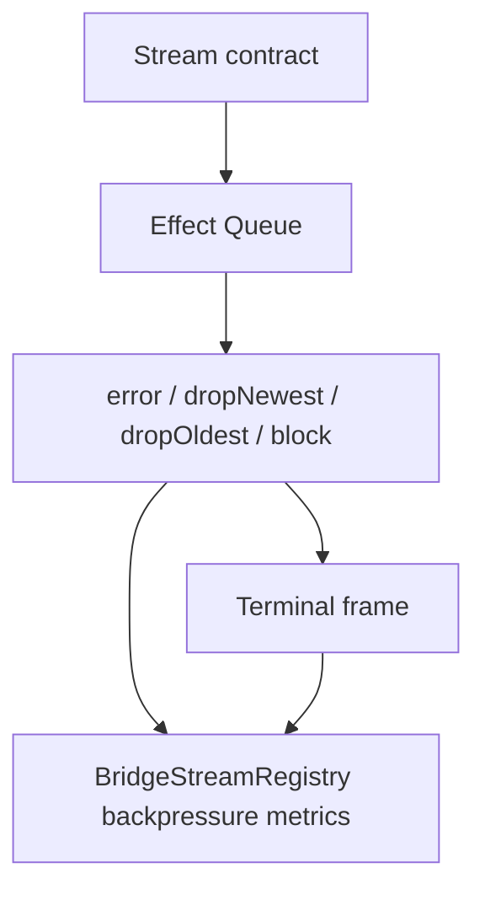

# Backpressure: bounded buffer on the renderer side; drop-or-block policy is contract-declared

## What we set out to do

Stream subscriptions needed bounded, contract-declared backpressure behavior with enough state for devtools to show queue capacity, queue depth, overflow policy, and frame loss. The existing stream runtime already used Effect queues for bounded delivery, but lossy policies were not observable.

## What actually ended up working

The stream runtime stayed as the lifecycle owner. `BridgeStreamRegistryEntry` now carries optional backpressure metrics, and the stream queue updates those metrics through Effect whenever frames are offered, drained, terminalized, or evicted. This keeps queue capacity, queue depth, overflow policy, and evicted-frame counts in the same snapshot that already owns stream terminal state. `error` remains a typed `BackpressureOverflow` failure, while `dropNewest` and `dropOldest` keep the stream successful and report loss through registry metrics.

## What surfaced in review

One review finding was addressed. The initial metrics counted data-frame overflow, but terminal-frame forcing can also remove queued data to ensure the terminal frame is delivered. That data is still lost from the consumer's perspective, so the fix counts terminal-forcing removals in `evictedFrames` and verifies the adjusted counts.

## First-principles postmortem

The invariant is not just "the queue is bounded"; it is "all data loss caused by the stream queue is observable." Terminal frames have higher priority than data frames, so the terminal path is also a backpressure path. Treating terminal delivery as lifecycle-only hid a real loss mechanism from the metric.

## Game-theory postmortem

The dangerous local move was to measure only the obvious overflow branch. That would let future devtools under-report loss exactly when streams complete under pressure, making slow consumers look healthier than they are. The correcting mechanism is a single metric counter owned by `StreamQueue`, updated from every code path that removes or rejects data.

## Non-obvious lesson

Terminal-frame delivery can be a lossy operation. If the queue is full, forcing `Complete`, `Error`, or `Closed` through may evict data even though no normal data-frame overflow branch ran. Backpressure metrics must count that path or the system rewards a false belief that terminal correctness and loss observability are independent.

## Reproducible pattern (if any)

When a terminal path is allowed to override a data path, audit it as part of the data-loss surface.
Keep one counter for the invariant, not one counter per branch.
Assert metrics after the consumer drains so queue depth represents observed state, not only producer state.

## AGENTS.md amendment candidate (if any)

For stream metrics, every path that drops, evicts, or refuses data must update the same observable counter; Why: branch-local counters systematically undercount loss when terminal or cleanup paths override data delivery.

This is a proposal. Review and edit AGENTS.md yourself if you want to adopt it — `/learn` never auto-edits AGENTS.md.
