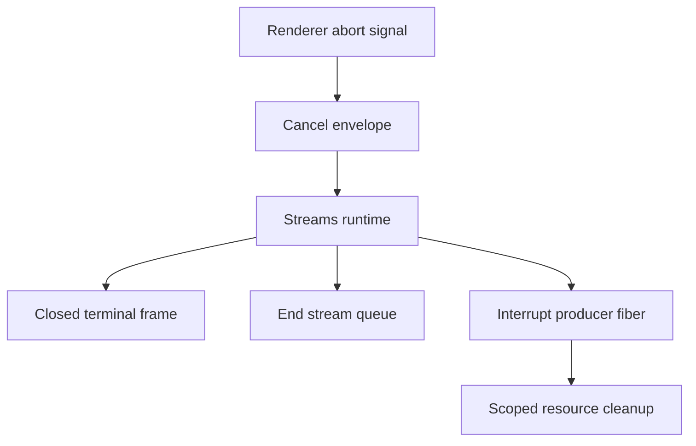

# Cancellation propagation: renderer interrupts a stream -> host stops emitting; resource scope closes

## What we set out to do

The stream bridge needed renderer-side cancellation to become a host-owned lifecycle event. When a renderer aborts a subscription, the host producer should stop emitting stale frames, the producer fiber should be interrupted, scoped resources should run their finalizers, and the renderer should observe a typed `Closed` terminal frame.

## What actually ended up working

The existing client already emitted `HostProtocolCancelByRequestEnvelope` from `AbortSignal`, so the missing mechanism was on the host stream runtime. `Streams` now exposes a `cancel` Effect, records active producer fibers by request id, emits a `closed` terminal frame through the same registry that owns terminal ordering, ends the queue, interrupts the producer fiber, and removes the active entry when the stream shuts down. The implementation stayed inside the stream module instead of adding another dispatcher layer, which kept the cancellation contract close to the queue, registry, and producer fiber it controls.

## What surfaced in review

No PR review comments had been posted when this learning was captured. Local validation and the Blacksmith Ubuntu, macOS, and Windows CI jobs were green before the learning commit. The main correction surfaced during self-review: the test must wait for the producer resource to be acquired before aborting, because request dispatch and producer acquisition are distinct lifecycle moments.

## First-principles postmortem

The invariant is that a terminal stream state must be owned by the host runtime, not inferred by the renderer disappearing. A renderer can stop listening before the producer fiber has started, while a producer can keep running after the renderer has stopped listening. Cancellation therefore needs an explicit control envelope plus an active producer table keyed by request id. Request id is the correct key at this boundary because the renderer knows the request before it knows the runtime-minted stream id.

## Game-theory postmortem

The bad local incentive is to make cancellation look correct by only closing the renderer subscription. That keeps the test short but shifts the cost to the host, where file watchers, PTYs, or child processes can continue running invisibly. The alignment mechanism is the `Closed` terminal frame: the host records the terminal state, closes the queue, and interrupts the producer in one Effect-owned path. Tests should assert producer finalizers, not only client-visible failure, because the resource leak is on the host side.

## Non-obvious lesson

Stream cancellation has two races: the renderer can abort before the producer is active, and the producer can emit after the renderer has already moved on. The first race belongs in tests; the second belongs in the runtime. A useful regression test waits for producer acquisition, then aborts, then verifies a typed `StreamClosed` failure, a `closed` registry terminal, and scoped finalizer execution.

## Reproducible pattern (if any)

For long-lived bridge streams, represent cancellation as a typed control envelope.
Track the active producer at the module that owns the queue and terminal registry.
Emit the terminal frame before ending the queue.
Assert host-side resource cleanup, not just renderer-visible completion.

## AGENTS.md amendment candidate (if any)

For stream cancellation work, tests must wait until the host producer has acquired its scoped resource before aborting; Why: otherwise the test can pass or fail based on stream startup timing instead of the cancellation invariant.

This is a proposal. Review and edit AGENTS.md yourself if you want to adopt it — `/learn` never auto-edits AGENTS.md.
