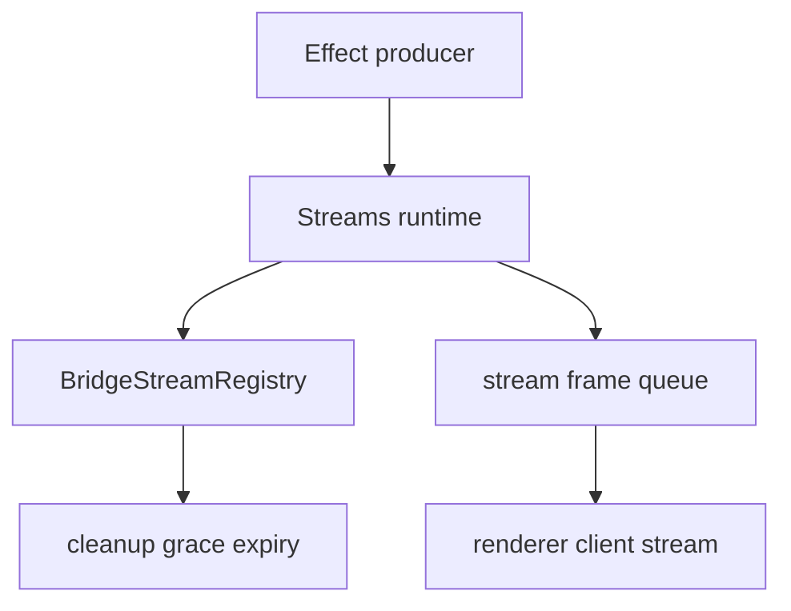

# Stream terminal lifecycle registry

## What we set out to do

Issue #74 asked for the bridge stream path to enforce the core terminal-frame invariant: every stream emits data frames followed by exactly one terminal frame, and bookkeeping is bounded by the 30 second cleanup grace from §10.6.

## What actually ended up working

The implementation adds `BridgeStreamRegistry` to `packages/bridge/src/streams.ts`, with Effect-returning `register`, `terminate`, `isTerminal`, `gcExpired`, and `snapshot` operations. The stream runtime now registers each generated stream id, records terminal state before offering terminal frames, drops data offered after terminal state, and garbage-collects expired terminal entries before opening a new stream. The registry keeps a separate generation counter so a reused stream id increments generation even after the terminal entry has been removed.

## What surfaced in review

No PR review threads were posted. A pre-review self-check caught that deleting the terminal entry on cleanup would reset generation for a reused stream id. The final registry keeps generation separately from active bookkeeping so cleanup can bound memory without losing reuse monotonicity.

## First-principles postmortem

Terminal state and generation state are different facts. Terminal state is short-lived bookkeeping for a specific subscription; generation state is identity history for an id. Deleting one must not erase the other, or a future frame can look like it belongs to an older subscription.

## Game-theory postmortem

The local shortcut was to use one map for both active lifecycle state and generation history. That makes cleanup easy but shifts ambiguity to the renderer when ids are reused. Splitting active entries from generation counters preserves bounded memory while keeping the repeated-game invariant that stream identity never goes backward.

## Non-obvious lesson

Cleanup is not deletion of all knowledge. For lifecycle registries, some facts expire because they are operational bookkeeping, while other facts persist because they protect identity and ordering. The module should encode that distinction directly.

## Reproducible pattern (if any)

Keep active lifecycle entries separate from monotonic identity counters.
Run cleanup before new registration to bound stale terminal bookkeeping.
Make terminal transition return a boolean so duplicate terminal offers become no-ops.
Test reuse after cleanup, not only cleanup itself.

## AGENTS.md amendment candidate (if any)

For registries with reusable ids, separate expiring lifecycle state from monotonic generation state; Why: cleanup should bound memory without erasing identity history.

This is a proposal. Review and edit AGENTS.md yourself if you want to adopt it - `/learn` never auto-edits AGENTS.md.
