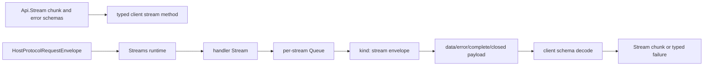

# Streams: Stream.Stream<A, E, R> over bridge with backpressure and chunking

## What we set out to do

Issue #116 set out to carry `Stream.Stream<A, E, R>` across the typed bridge with schema-validated chunks, structured stream errors, declared backpressure, and exactly one terminal frame. The invariant was that a runtime producer could not outrun the renderer without the contract's policy firing, and renderer code should consume a typed `Stream` rather than raw transport frames.

## What actually ended up working

The shipped bridge adds `Api.Stream(chunk, error, backpressure?)` as a stream output spec for contract methods. `Client(...)` now detects stream method outputs and returns `Stream.Stream<Chunk, StreamError | HostProtocolError, never>` instead of an `Effect`, while `Streams(...)` binds stream-producing handlers into a runtime-side stream dispatcher. Stream frames use the existing `kind: "stream"` envelope with an explicit frame payload union for `data`, `error`, `complete`, and `closed`, keeping terminal meaning out of arbitrary payloads. The runtime producer writes schema-encoded frames through a per-stream `Queue`; overflow `"error"` becomes a typed `BackpressureOverflow`, protocol failures travel through the envelope error channel, and domain stream failures travel through the typed stream error channel.

## What surfaced in review

There were no posted review threads. The local `/code-review` pass caught one issue before posting: the first implementation detached the producer fiber from renderer consumption, which meant a renderer that stopped reading could leave runtime work alive. The fix changed producer ownership to a scoped fiber tied to the returned stream finalizer before the no-findings review was posted.

## First-principles postmortem

The core invariant was not "stream frames can be encoded." It was "the lifetime of the producer is owned by the stream being consumed." A bridge stream has two resources: the queue and the producer fiber. If the queue is returned but the fiber is detached, the public `Stream` type lies about ownership and cleanup. Making the producer fiber scoped to the returned stream made the lifecycle invariant local and testable.

## Game-theory postmortem

The local shortcut was to use `forkDetach` because it made producer/consumer concurrency easy and got the happy-path tests passing. That rewards the implementer who wants to move frames quickly, but it shifts cost to future renderer authors and runtime operators when abandoned consumers keep work alive. The mechanism that improved alignment was treating fiber ownership as part of the bridge stream module, not as caller discipline. Future reviews should ask "who owns the fiber when the consumer stops?" any time a module converts an Effect `Stream` into queued protocol frames.

## Non-obvious lesson

Frame shape and typed errors are only half of a stream bridge. The harder part is lifecycle ownership: the producer fiber, queue, terminal frame, and renderer consumer must share one ownership boundary. If any one of those is detached from the returned stream, the API can look typed while leaking runtime work.

## Reproducible pattern (if any)

Use explicit frame payload unions for terminal semantics instead of overloading arbitrary payloads.
Encode domain stream errors into stream payload frames; put protocol failures in the envelope error field.
When a stream bridge forks a producer, scope the fiber to the returned stream and verify finalization.

## AGENTS.md amendment candidate (if any)

When bridging an Effect `Stream` through a queue or transport, tests and review must prove producer ownership is tied to consumer finalization; Why: a typed stream that detaches its producer silently leaks runtime work.

This is a proposal. Review and edit AGENTS.md yourself if you want to adopt it — `/learn` never auto-edits AGENTS.md.
