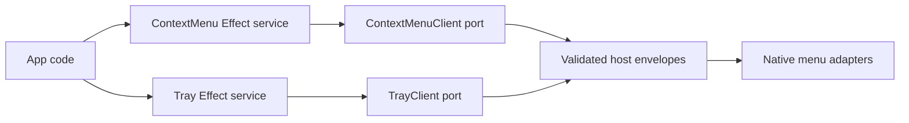

# Tray and ContextMenu service contracts

## What we set out to do

Issue #47 asked for sibling Tray and ContextMenu services that reuse the
existing `MenuTemplate` grammar. The invariant was that context menus stay
window-scoped, tray icons stay app-scoped, and both activation paths carry
`commandId` values for later command routing.

## What actually ended up working

The implementation adds concrete schema files under
`packages/native/src/contracts/context-menu.ts` and
`packages/native/src/contracts/tray.ts`, with Effect service and bridge clients
in `packages/native/src/context-menu.ts` and `packages/native/src/tray.ts`.
`ContextMenu` is a value/event service: it validates a window handle, menu
template, and logical popup position. `Tray.create` returns an `Api.Resource`
handle because the tray icon is a durable host object with later mutation and
destroy operations.

## What surfaced in review

No review threads were opened. The local review focused on preserving the
already-tested `MenuTemplate` grammar, keeping unsupported host behavior in the
Effect error channel, and ensuring only `Tray.create` uses a resource handle.

## First-principles postmortem

Tray and ContextMenu share menu data, but they do not share lifecycle. A context
menu is an immediate window-targeted popup; a tray icon is a long-lived native
object. Modeling those two facts directly gives callers a narrow interface while
leaving platform-specific native API differences below the service boundary.

## Game-theory postmortem

If both services invented their own menu item schema, future command routing
would fragment across subtly different `commandId` shapes. Reusing
`MenuTemplate` makes the lowest-friction path the consistent path. Separating
ContextMenu value calls from Tray resource calls also discourages future callers
from treating short-lived popups as owned resources.

## Non-obvious lesson

Shared input grammar is not the same as shared lifecycle. Native services can
compose over the same schema while still exposing different ownership models:
context menus are transient host actions, tray icons are durable host resources.

## Reproducible pattern (if any)

For sibling native services over a shared grammar:

- import and reuse the existing schema rather than duplicating it;
- keep lifecycle-specific return types at each service boundary;
- test the same template through every bridge client that accepts it;
- model unsupported host behavior as typed Effect failures.

## AGENTS.md amendment candidate (if any)

When two native services share data but not lifecycle, share only the schema and
keep their resource/value return types separate. Why: common grammar should not
force common ownership.

This is a proposal. Review and edit AGENTS.md yourself if you want to adopt it —
`/learn` never auto-edits AGENTS.md.
