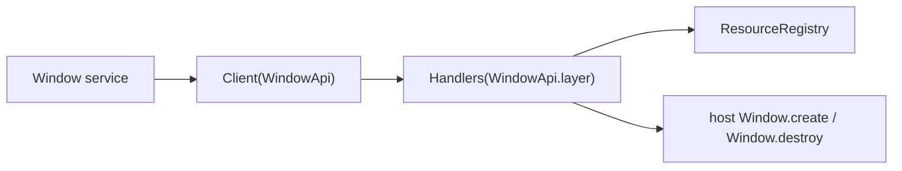

# Typed Window.create and Window.close going through the bridge to the host

## What we set out to do

Issue #131 required `Window.create` and `Window.close` to stop using the raw Phase 3 smoke path directly from app-facing code. The public `Window` service needed to call through the typed `WindowApi` client, the runtime handler needed to bind `WindowApi` to the existing host `Window.create` / `Window.destroy` envelopes, and the resource registry needed to show the window only during its lifetime.

## What actually ended up working

The final shape splits the bridge in two explicit halves. `makeWindowBridgeClientLayer()` supplies `WindowClient` through `Client({ Window: WindowApi })`, so service calls go through the contract client. `makeHostWindowApiLayer()` supplies the runtime handler side with `WindowApi.layer(...)`, calls the existing host window client, and records `window/open` handles in `ResourceRegistry`.

The resource registry cleanup type is `never`, while host destroy can fail as `HostProtocolError`, so the close path performs host destroy first and removes the registry entry only after that succeeds. This avoids hiding host failures in a best-effort disposer.

## What surfaced in review

Two review comments changed the final implementation. First, `persistState` belongs to the public `Window.create` input but not to the strict Phase 3 host payload, so the runtime handler strips it before calling the host envelope. Second, repeated close on a known disposed handle must remain `StaleHandle`, not collapse into `NotFound`; the handler now tracks known host window ids to preserve the lifecycle distinction.

## First-principles postmortem

The invariant was not just "send a host request." It was "one typed path owns validation, transport, host calls, and resource lifetime." That made the service/client/handler split necessary, but it also exposed where failure ownership changes. Host failure cannot be shoved into a registry disposer that cannot fail; the operation that can fail must stay in the typed `Window.close` effect.

## Game-theory postmortem

The tempting shortcut was to wrap `makeHostWindowClient` directly in the service and call it done. That would make the first issue cheap while leaving the contract path unused. The better mechanism makes the typed route the easiest route: tests exercise `Window` service → generated client → handler layer → host exchange, so future changes that bypass the contract lose the existing test harness.

## Non-obvious lesson

Public service inputs and host protocol payloads can look almost identical while carrying different responsibilities. Treating them as the same object rewards accidental forwarding; an explicit adapter keeps public policy fields like `persistState` out of strict host envelopes.

## Reproducible pattern (if any)

Model public service input separately from host protocol payload.
Use the typed client and handler layer in tests, not a direct host helper.
Let the effect that can fail own the failing operation.
Track known ids when lifecycle errors must distinguish stale handles from unknown resources.

## AGENTS.md amendment candidate (if any)

For service-to-host adapters, test the full contract client plus handler path before accepting a direct host helper wrapper; Why: direct wrappers bypass the mechanism the framework is trying to make authoritative.

This is a proposal. Review and edit AGENTS.md yourself if you want to adopt it — `/learn` never auto-edits AGENTS.md.
