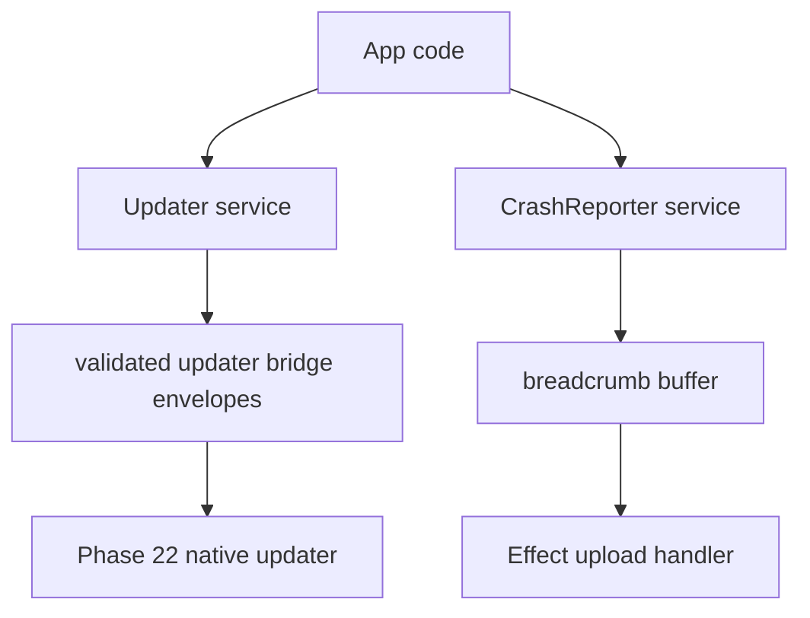

# Updater and CrashReporter consume surface

## What we set out to do

Issue #55 asked for consume-only `Updater` and `CrashReporter` services before Phase 22 owns install staging and crash upload plumbing. The goal was to let apps depend on stable Effect service surfaces now while keeping dangerous native install and upload behavior explicit, typed, and deferred.

## What actually ended up working

The final PR adds schema-backed Updater and CrashReporter contracts, service ports, bridge clients, unsupported clients, and focused tests. `Updater.check` and `getStatus` expose typed consumer values, while install/download/restart paths can return `Unsupported { reason: "phase-22" }`. `CrashReporter` has a functional in-memory breadcrumb buffer with `start`, `recordBreadcrumb`, `flush`, and an Effect upload handler for local consume-side tests. Bridge-backed upload handlers are rejected as typed `Unsupported` values because functions cannot cross the host protocol.

## What surfaced in review

Two automated review findings were addressed. First, `CrashReporter.flush` originally read the buffer, awaited upload, then cleared the latest buffer, which could erase breadcrumbs recorded while upload was running. Second, the bridge `start` path silently ignored `uploadHandler`, even though function handlers are not bridge-serializable. The final code drains with `Ref.modify`, preserves new breadcrumbs recorded during upload, requeues drained breadcrumbs on upload failure, and rejects bridge upload handlers with `Unsupported`.

## First-principles postmortem

The invariant is not "flush eventually returns"; it is "a breadcrumb is either uploaded or still buffered." A buffer flush crosses an asynchronous boundary, so read-then-clear is not a state transition. The state transition must be the atomic drain, and upload must be a separate effect that cannot delete entries recorded after the drain.

## Game-theory postmortem

The bad local move was treating Phase 22 deferral as permission to make no-op behavior look successful. Silent handler drops create false confidence for app authors, and read-then-clear makes concurrency bugs invisible until a production crash report is missing the most important breadcrumb. Typed `Unsupported` and atomic drain make the honest path cheaper than the misleading path.

## Non-obvious lesson

Consume-only services still need real lifecycle semantics. A deferred native backend can be represented by typed unsupported failures, but local state such as breadcrumbs is already production-shaped code: it needs atomic state transitions, failure preservation, and no silent callback loss.

## Reproducible pattern (if any)

Use `Ref.modify` to drain queues before asynchronous effects.
If the async effect fails, requeue the drained batch before returning the typed failure.
Reject unrepresentable bridge inputs with typed `Unsupported`; do not silently drop them.
Add a regression test where the handler records a new item during flush.

## AGENTS.md amendment candidate (if any)

When a consume-only service includes local buffers, model buffer state transitions atomically even if the native backend is deferred; Why: deferred integration does not make local lifecycle state disposable.

This is a proposal. Review and edit AGENTS.md yourself if you want to adopt it - `/learn` never auto-edits AGENTS.md.
