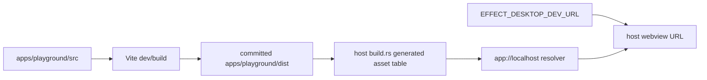

# Vite-compatible build pipeline producing apps/playground/dist; HMR in dev

## What we set out to do

The issue called for one renderer build path: Vite dev HMR for the playground, production output under `apps/playground/dist`, nonce placeholders in emitted HTML, and host startup wiring that can load a dev URL while production keeps serving embedded `app://` assets.

## What actually ended up working

The shipped shape matches the issue, with one important implementation correction: Cargo does not run Vite. The playground owns Vite, React, Tailwind, source files, and the committed production `dist/`; the host build script only scans the already-built `dist/` and generates an embedded asset table. That keeps Rust checks deterministic in a fresh checkout and still lets Vite emit hashed filenames.

## What surfaced in review

No PR review threads changed the result. Local verification did surface two review-equivalent findings before push: generated Vite bundles polluted oxlint/type-aware lint output, and host tests still assumed fixed `app.js`/`style.css` filenames. Both were addressed by excluding committed `dist` from static analysis and testing asset discovery through the built `index.html`.

## First-principles postmortem

The invariant was not "the host knows the renderer filenames"; it was "the host can serve every production renderer asset by path." Once Vite owns hashes, filenames are build outputs, not source contracts. Moving that knowledge into generated Rust metadata keeps the host interface narrow: callers still ask for a path and receive bytes plus a content type.

## Game-theory postmortem

The local incentive was to hard-code the first successful Vite output, because it makes the first build pass quickly. That creates a bad equilibrium where every hash change requires a Rust edit and generated code gets linted as if it were authored code. The better mechanism is source ownership: Vite owns generated renderer assets; Rust owns embedding and serving; lint owns source files, not committed bundles.

## Non-obvious lesson

Committed build artifacts are sometimes a product requirement, but they should not become authored source in every tool's eyes. Treat them as input to the embedding boundary and explicitly keep static analysis pointed at the source that produced them.

## Reproducible pattern (if any)

When a host embeds frontend build output:

1. Build artifacts may be committed for packaging determinism.
2. The native host should discover artifact paths instead of knowing bundler filenames.
3. Source lint and type-aware analysis should exclude generated bundles.
4. Tests should derive asset paths from the emitted manifest or HTML.

## AGENTS.md amendment candidate (if any)

When committing generated `dist/` assets, add explicit lint/type-aware ignore coverage and test the source-to-artifact boundary instead of linting minified bundles. Why: generated bundles produce third-party warnings and obscure real source failures.

This is a proposal. Review and edit AGENTS.md yourself if you want to adopt it — `/learn` never auto-edits AGENTS.md.
